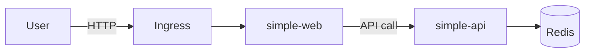
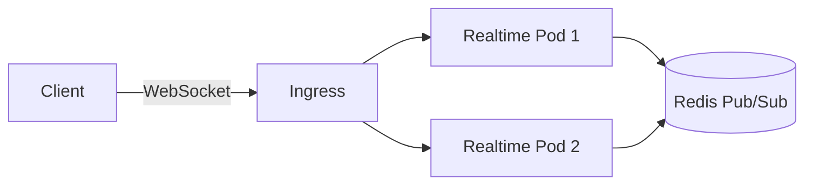

# Kubernetes Learning Curriculum
## kindで学ぶK8s入門から実践まで

---

## この教材の目的

初心者がkindから始めて、最終的に障害対応・EKS移行・WebSocketのリアルタイム運用まで学べるように設計された学習教材です。

「YAMLを暗記する」のではなく、「なぜそうするのか」を理解することを重視しています。

---

## 想定読者

- Dockerは使ったことがある
- Kubernetesは初めて or 少し触った程度
- 本番環境での運用経験はない

---

## 前提知識

- Dockerの基本操作（build, run, push）
- ターミナル操作
- YAMLの基本文法
- HTTPの基本

---

## 必要ツール一覧

| ツール | 用途 | 必須/任意 |
|--------|------|-----------|
| Docker | コンテナ実行環境 | 必須 |
| kind | ローカルK8sクラスタ | 必須 |
| kubectl | K8s操作CLI | 必須 |
| Go 1.22+ | APIサーバーのローカル実行・改造（イメージビルドはDockerのみで可能） | 任意 |
| Node.js 18+ | フロント開発（任意） | 任意 |
| make | ビルド自動化 | 任意 |
| k6 | 負荷試験 | 任意 |
| jq | JSON整形 | 任意 |
| hey / vegeta | HTTP負荷試験 | 任意 |

---

## セットアップ手順

```bash
git clone <repo-url>
cd K8s-Learn
make cluster-create
make build-images
make load-images
```

上記コマンドで、kindクラスタの作成からアプリイメージのビルド・ロードまで一括で行えます。

---

## 学習の進め方

Step01から順番に進めてください。各ステップのディレクトリにあるREADME.mdに従って学習を進めます。

前のステップで学んだ知識が次のステップの前提になっているため、飛ばさずに順番に取り組むことをおすすめします。

---

## Step一覧

| Step | タイトル | 概要 | 難易度 |
|------|----------|------|--------|
| 01 | kindクラスタ構築 | ローカルK8sクラスタの作成 | ★☆☆☆☆ |
| 02 | Pod | 最小実行単位の理解 | ★☆☆☆☆ |
| 03 | Deployment | 自動復旧・レプリカ管理 | ★★☆☆☆ |
| 04 | Service | サービスディスカバリ | ★★☆☆☆ |
| 05 | Ingress | HTTPルーティング | ★★☆☆☆ |
| 06 | ConfigMap/Secret | 設定の外部化 | ★★☆☆☆ |
| 07 | Volume | 永続化ストレージ | ★★☆☆☆ |
| 08 | Probes/Resources | ヘルスチェックとリソース制限 | ★★★☆☆ |
| 09 | HPA | 自動スケーリング | ★★★☆☆ |
| 10 | Observability | 可観測性（Prometheus/Grafana） | ★★★☆☆ |
| 11 | ミニ構成 | 複数サービス連携 | ★★★☆☆ |
| 12 | 障害再現ドリル | 障害対応の実践 | ★★★★☆ |
| 13 | アーキテクチャレビュー | 構成の批評と改善 | ★★★★☆ |
| 14 | EKS移行ガイド | クラウド移行の視点 | ★★★★☆ |
| 15 | WebSocket基礎 | リアルタイム通信入門 | ★★★☆☆ |
| 16 | WebSocketスケール | 複数Pod対応 | ★★★★☆ |
| 17 | WebSocket負荷試験 | ボトルネック体験 | ★★★★★ |

### 応用編（advanced/）

Step17まで完了した人向けの発展テーマ。順不同で取り組める。

| 演習 | タイトル | 概要 |
|------|----------|------|
| ex01 | ローリングアップデートとロールバック | 無停止デプロイと切り戻し |
| ex02 | Job / CronJob | バッチ処理と定期実行 |
| ex03 | セキュリティ強化とPDB | 非root実行・readOnlyRootFilesystem・PodDisruptionBudget |
| ex04 | NetworkPolicy | Pod間通信の最小権限化 |

---

## ディレクトリ構成

```
K8s-Learn/
├── README.md                          # この教材のルートREADME
├── Makefile                           # クラスタ操作・ビルド自動化
├── docs/
│   ├── architecture-overview.md       # 全体アーキテクチャ解説
│   ├── common-commands.md             # よく使うコマンド集
│   ├── glossary.md                    # 用語集
│   └── troubleshooting.md            # トラブルシューティングガイド
├── apps/
│   ├── simple-api/                    # Go製APIサーバー（Redisカウンター付き）
│   │   ├── Dockerfile
│   │   ├── main.go
│   │   └── go.mod
│   ├── simple-web/                    # フロントエンド
│   │   ├── Dockerfile
│   │   ├── nginx.conf
│   │   └── index.html
│   ├── realtime-api/                  # WebSocketサーバー
│   │   ├── Dockerfile
│   │   ├── main.go
│   │   └── go.mod
│   └── loadtest/                      # k6負荷試験スクリプト
│       ├── http-test.js
│       └── ws-test.js
├── step01-kind-cluster/               # kindクラスタ構築
│   ├── README.md
│   └── kind-config.yaml
├── step02-pod/                        # Pod基礎
│   ├── README.md
│   └── pod.yaml
├── step03-deployment/                 # Deployment
│   ├── README.md
│   └── deployment.yaml
├── step04-service/                    # Service
│   ├── README.md
│   └── service.yaml
├── step05-ingress/                    # Ingress
│   ├── README.md
│   └── ingress.yaml
├── step06-configmap-secret/           # ConfigMap/Secret
│   ├── README.md
│   ├── configmap.yaml
│   ├── secret.yaml
│   └── deployment.yaml
├── step07-volume/                     # Volume
│   ├── README.md
│   ├── pvc.yaml
│   └── deployment.yaml
├── step08-probes-resources/           # Probes/Resources
│   ├── README.md
│   └── deployment.yaml
├── step09-hpa/                        # HPA
│   ├── README.md
│   ├── deployment.yaml
│   └── hpa.yaml
├── step10-observability/              # 可観測性
│   ├── README.md
│   ├── namespace.yaml
│   ├── prometheus-*.yaml
│   └── grafana-deployment.yaml
├── step11-mini-architecture/          # ミニ構成
│   ├── README.md
│   └── *.yaml
├── step12-failure-drill/              # 障害再現ドリル
│   ├── README.md
│   └── scenarios/
├── step13-architecture-review/        # アーキテクチャレビュー
│   ├── README.md
│   ├── review-template.md
│   └── before-after.md
├── step14-eks-migration/              # EKS移行ガイド
│   ├── README.md
│   └── terraform/
├── step15-websocket-basics/           # WebSocket基礎
│   ├── README.md
│   └── *.yaml
├── step16-websocket-scale/            # WebSocketスケール
│   ├── README.md
│   └── *.yaml
├── step17-websocket-loadtest/         # WebSocket負荷試験
│   └── README.md
└── advanced/                          # 応用編（Step17完了後の発展テーマ）
    ├── README.md
    ├── ex01-rolling-update/
    ├── ex02-job-cronjob/
    ├── ex03-security-hardening/
    └── ex04-networkpolicy/
```

---

## 全体アーキテクチャ図

### HTTP系（Step01〜Step14）



ユーザーからのHTTPリクエストはIngressで受け、simple-webへルーティングされます。simple-webはsimple-apiを呼び出し、simple-apiはRedisにデータを保存・取得します。

### WebSocket系（Step15〜Step17）



WebSocket接続はIngressを通じて各Realtime Podに振り分けられます。Pod間のメッセージ同期にはRedis Pub/Subを使用します。

---

## 学習後に何ができるようになるか

1. **Kubernetesの基本リソースを理解できる** - Pod, Deployment, Service, Ingress, ConfigMap, Secret, Volume, HPAの役割と使い方
2. **ローカルのkindで複数サービスを動かせる** - フロント・API・Redis連携の構成をkind上で構築できる
3. **障害・負荷・運用の基本を体験できる** - CrashLoopBackOff, OOMKilled, スケーリングなどを手を動かして理解できる
4. **kind構成をEKSへ持っていく視点を得られる** - ローカル学習からクラウド本番へのギャップと対応策を把握できる
5. **WebSocketのリアルタイム処理をK8s上でどう扱うか理解できる** - 接続の維持、スケールアウト、Redis Pub/Subによる同期を学べる

---

## 注意点

- **kindは本番環境ではありません** - あくまでローカル学習用のツールです。本番ではEKS/GKE/AKSなどを使います
- **IngressやStorageはローカル簡易版です** - 本番ではALB Ingress Controller, EBS CSI Driverなどを使います
- **HPAや可観測性は最小構成です** - 本番ではカスタムメトリクス、Datadog、New Relicなどを組み合わせます
- **この教材は「YAML暗記」ではなく「なぜそうするか」の理解が目的です** - マニフェストの各行が何をしているかを意識してください
