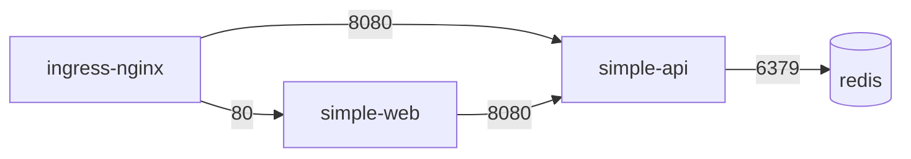

# ex04: NetworkPolicy — Pod 間通信の最小権限化

## 目的

Step13 のレビューで指摘した「すべての Pod 間で無制限に通信可能」という状態を解消する。
default-deny を土台に必要な通信だけを許可する、ネットワークの最小権限の考え方を学ぶ。

## 学ぶこと

- Kubernetes はデフォルトで「全 Pod 間通信が許可」されていること
- default-deny + allowlist 方式のポリシー設計
- `podSelector` / `namespaceSelector` による通信元の指定
- NetworkPolicy は CNI プラグインが強制すること（リソースを作るだけでは動かない場合がある)

## 前提条件

- Step11 の mini-app 構成（web / api / redis）がデプロイ済みであること
- **kind v0.23.0 以降**であること。デフォルト CNI（kindnet）が NetworkPolicy を強制するのは v0.23.0 から。それより古い場合は Calico 等の CNI を別途導入する必要がある

```bash
kind version
# v0.23.0 以上であることを確認する
```

> **重要**: NetworkPolicy リソースは「作成できるが何も強制されない」ことがある。
> CNI が対応していない環境では、ポリシーを適用しても通信は遮断されない。
> このため、適用後は必ず下の手順のように「遮断されること」をテストで確認する。

## 通信経路の設計



この4本の矢印**以外**の通信をすべて遮断する。

## 実行手順

```bash
# 0. 適用前: どこからでも Redis に届いてしまうことを確認する
kubectl run nettest -n mini-app --image=busybox:1.36 --restart=Never -it --rm -- \
  nc -zv -w 3 redis 6379
# → "open" と表示される（誰でも Redis に接続できる状態）

# 1. NetworkPolicy を適用する
kubectl apply -f networkpolicy.yaml
kubectl get networkpolicy -n mini-app

# 2. 関係ない Pod から Redis への接続が遮断されたことを確認する
kubectl run nettest -n mini-app --image=busybox:1.36 --restart=Never -it --rm -- \
  nc -zv -w 3 redis 6379
# → タイムアウトして失敗すれば成功

# 3. 許可された通信は生きていることを確認する
# simple-api → redis（許可されている）
kubectl exec -n mini-app deploy/simple-api -- nc -zv -w 3 redis 6379

# simple-web → simple-api（許可されている）
kubectl exec -n mini-app deploy/simple-web -- wget -qO- -T 3 http://simple-api:8080/health

# 4. ブラウザ経由の動作も確認する（ingress-nginx → web/api が許可されている）
curl http://mini-app.local/api/count

# 5. 遮断される通信の例: simple-web から redis へは届かない
kubectl exec -n mini-app deploy/simple-web -- nc -zv -w 3 redis 6379 || echo "遮断OK"

# 6. クリーンアップ（ポリシーを外すと元の全許可に戻る）
kubectl delete -f networkpolicy.yaml
```

## 確認方法

1. 適用前は任意の Pod から redis:6379 に接続できること
2. 適用後、テスト Pod からの接続がタイムアウトすること
3. api → redis、web → api、ブラウザ → web/api は引き続き通ること
4. `kubectl describe networkpolicy -n mini-app` でポリシー内容を説明できること

## よくある失敗

| 症状 | 原因 | 対処 |
|---|---|---|
| ポリシーを適用しても何も遮断されない | CNI が NetworkPolicy に対応していない | kind v0.23.0+ を使うか、Calico / Cilium を導入する。「遮断テスト」を必ず行う |
| 全部の通信が突然死んだ | default-deny だけ適用して許可ポリシーを忘れた | allowlist のポリシーをセットで適用する。本番では段階的に適用する |
| Ingress 経由のアクセスが 502 になる | Ingress Controller の namespace からの通信を許可していない | `namespaceSelector` で ingress-nginx namespace を許可する |
| DNS が解決できなくなった | Egress ポリシーで kube-dns への UDP/53 を塞いだ | Egress を制限する場合は kube-system の DNS への通信を明示的に許可する |
| ラベル変更でポリシーが効かなくなる | ポリシーは label セレクタで対象を決める | label の命名規則を統一し、ポリシーとセットでレビューする |

## 本番だとどう変わるか

- **namespace 単位の標準ポリシー**: 新しい namespace には必ず default-deny を適用する運用にする（ポリシーエンジンで強制）
- **Egress 制御**: 外部 API への通信も最小限に制限し、データ持ち出しを防ぐ
- **Cilium / Calico の拡張ポリシー**: L7（HTTP メソッド・パス単位）の制御や FQDN ベースの Egress 制御が可能
- **Service Mesh との併用**: NetworkPolicy は L3/L4、mTLS や認可は Service Mesh（Istio 等）で重ねて防御する
- **可視化**: Hubble（Cilium）等で「どの通信が遮断されたか」を観測し、ポリシーの過不足を検証する
