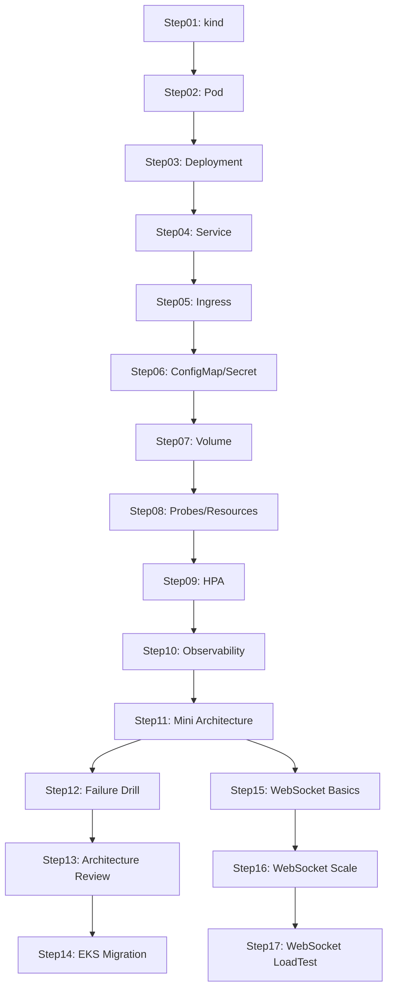
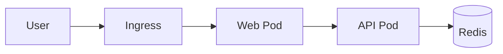
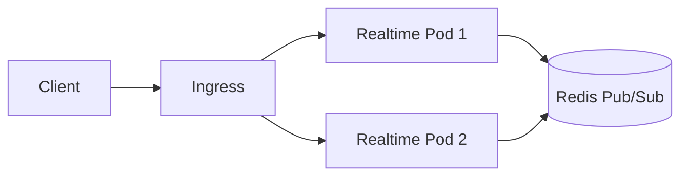

# アーキテクチャ概要

この教材全体の構成、各ステップのつながり、学習フローについて説明します。

---

## 学習パス全体像



---

## 4つの学習フェーズ

### フェーズ1: 基礎（Step01〜05）

Kubernetesの最も基本的なリソースを1つずつ学ぶフェーズ。kindでローカルクラスタを構築し、Pod、Deployment、Service、Ingressと段階的に構成を積み上げる。このフェーズが完了すると「ローカル環境でWebアプリを外部公開する」一連の流れが理解できる。

### フェーズ2: 構成管理（Step06〜09）

アプリケーションの構成をより実践的にするフェーズ。ConfigMap/Secretで設定を外部化し、Volumeでデータを永続化し、Probeでヘルスチェックを追加し、HPAでオートスケールを実現する。このフェーズが完了すると「本番に近い構成のPod」を作れるようになる。

### フェーズ3: 運用・本番移行（Step10〜14）

運用に踏み込むフェーズ。可観測性（ログ・メトリクス）を導入し、複数サービスを組み合わせたミニアーキテクチャを構築し、障害訓練で耐障害性を検証する。最終的にkindからEKSへの移行を行い、クラウド本番環境を体験する。

### フェーズ4: WebSocketリアルタイム系（Step15〜17）

HTTP以外のプロトコルに挑戦するフェーズ。WebSocketの基本的なKubernetes上での動作を理解し、Redis Pub/Subを使った複数Pod間のメッセージ同期、k6による負荷テストまでを行う。

---

## kindからEKSまでの流れ

```
Step01〜13: kind（ローカル）
  ↓ 学んだマニフェストをベースに
Step14: EKS（AWS）
  ↓ 差分を理解
  - Ingress → AWS ALB Controller
  - PVC → EBS CSI Driver
  - Service → LoadBalancer (NLB)
  - ノード管理 → マネージドノードグループ
```

kindで学んだマニフェストの大部分はEKSでもそのまま使える。ただし、Ingress Controller、ストレージ、ロードバランサなどインフラ層に近い部分はクラウドプロバイダ固有のリソースに置き換わる。kindで概念を十分に理解してからEKSに進むことで、差分だけに集中できる。

---

## HTTP系構成とWebSocket系構成の違い

### HTTP系構成（Step01〜14）



- リクエスト・レスポンス型の通信
- ステートレス：どのPodに振り分けてもOK
- Ingressのデフォルト設定で問題なく動作
- スケーリングが容易（HPAで単純にPod数を増やせる）

### WebSocket系構成（Step15〜17）



- 長時間接続（コネクションを維持する）
- ステートフル：クライアントは特定のPodに接続し続ける
- Ingressの設定変更が必要（タイムアウト延長、WebSocket対応アノテーション）
- スケーリング時にPod間メッセージ同期が必要（Redis Pub/Sub）
- Pod削除時のコネクション切断への対応（graceful shutdown）

---

## 難易度の変化ポイント

### Step01〜09: 入門〜基礎

1つのリソースを理解してマニフェストを書く、という繰り返し。手を動かせば確実に進める範囲。

### Step10あたりから: 運用寄りに

Step10（Observability）からは「動かすだけ」ではなく「監視する」「問題を見つける」という運用視点が求められる。Step11では複数サービスを連携させるため、全体像の理解が必要になる。Step12の障害訓練では意図的にPodを落とすため、リカバリの知識も問われる。

### Step15から: WebSocket系は別世界

HTTP系とは異なる知識が必要になる。長時間接続の管理、Pub/Subによるメッセージ同期、負荷テストツール（k6）の使い方など、学ぶべきことが一気に増える。Step11まで完了していれば基礎力は十分なので、焦らず進めれば問題ない。

---

## 各Stepの依存関係まとめ

| Step | 前提 | 学ぶこと |
|------|------|----------|
| Step01 | なし | kindでクラスタ作成 |
| Step02 | Step01 | Pod定義とライフサイクル |
| Step03 | Step02 | Deploymentでレプリカ管理 |
| Step04 | Step03 | Serviceでネットワーク公開 |
| Step05 | Step04 | Ingressで外部公開 |
| Step06 | Step05 | ConfigMap/Secretで設定外部化 |
| Step07 | Step06 | PVC/Volumeでデータ永続化 |
| Step08 | Step07 | Probe/リソース制限 |
| Step09 | Step08 | HPAでオートスケール |
| Step10 | Step09 | ログ・メトリクスの収集 |
| Step11 | Step10 | 複数サービスの統合 |
| Step12 | Step11 | 障害シミュレーション |
| Step13 | Step12 | 構成レビューと改善 |
| Step14 | Step13 | EKSへの移行 |
| Step15 | Step11 | WebSocket基礎 |
| Step16 | Step15 | WebSocket + Redis Pub/Sub |
| Step17 | Step16 | k6による負荷テスト |
