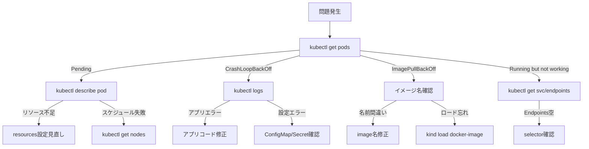

# トラブルシューティングガイド

Kubernetes で問題が発生したとき、何をどの順番で調べるかをまとめたガイドです。

---

## まず何を見るか？

問題が起きたらまず `kubectl get pods` を実行し、Pod の状態に応じて次のアクションを決めます。



---

## よくあるミス一覧

### 1. ImagePullBackOff - kindにイメージ未ロード

| 項目 | 内容 |
|------|------|
| **症状** | Pod が `ImagePullBackOff` または `ErrImagePull` になる |
| **原因** | Docker でビルドしたイメージを kind クラスタにロードしていない。kind は独自のコンテナランタイムを使うため、ホストの Docker イメージを直接参照できない |
| **対処** | `kind load docker-image <image-name>:latest --name k8s-learning` を実行する |

### 2. CrashLoopBackOff - アプリ起動失敗

| 項目 | 内容 |
|------|------|
| **症状** | Pod が `CrashLoopBackOff` を繰り返す |
| **原因** | アプリケーションが起動直後にエラーで終了している。設定ミス、依存サービス未起動、バイナリのビルドエラーなど |
| **対処** | `kubectl logs <pod-name>` でエラーメッセージを確認する。`--previous` フラグで前回のクラッシュログも確認できる |

### 3. Pending Pod - リソース不足 or PVC未作成

| 項目 | 内容 |
|------|------|
| **症状** | Pod が `Pending` のまま `Running` にならない |
| **原因** | ノードのリソース（CPU/メモリ）が不足している、または PersistentVolumeClaim がバインドされていない |
| **対処** | `kubectl describe pod <pod-name>` の Events セクションを確認する。リソース不足なら `resources.requests` を下げるか、ノードを追加する |

### 4. Service selector mismatch - labels不一致

| 項目 | 内容 |
|------|------|
| **症状** | Service にアクセスしても応答がない。`kubectl get endpoints <svc-name>` で Endpoints が空 |
| **原因** | Service の `spec.selector` と Pod の `metadata.labels` が一致していない |
| **対処** | `kubectl get pods --show-labels` で Pod のラベルを確認し、Service の selector と照合する |

### 5. Ingress Controller未導入

| 項目 | 内容 |
|------|------|
| **症状** | Ingress リソースを作成したが外部からアクセスできない |
| **原因** | Ingress Controller（nginx-ingress など）がクラスタにインストールされていない。Ingress リソースだけでは動作しない |
| **対処** | `kubectl apply -f https://raw.githubusercontent.com/kubernetes/ingress-nginx/controller-v1.12.1/deploy/static/provider/kind/deploy.yaml` で nginx Ingress Controller を導入する |

### 6. ConfigMap/Secretのキーミス

| 項目 | 内容 |
|------|------|
| **症状** | Pod が起動しない、または環境変数が空になる |
| **原因** | `configMapKeyRef.key` や `secretKeyRef.key` で指定したキー名が ConfigMap/Secret に存在しない |
| **対処** | `kubectl get configmap <name> -o yaml` でキー名を確認し、Deployment の参照と一致させる |

### 7. Volume mount path間違い

| 項目 | 内容 |
|------|------|
| **症状** | アプリが設定ファイルを読めない、またはデータが永続化されない |
| **原因** | `volumeMounts.mountPath` がアプリケーションの期待するパスと異なっている |
| **対処** | アプリケーションが参照するパスと `mountPath` を一致させる。`kubectl exec` でコンテナ内のファイル配置を確認する |

### 8. OOMKilled - メモリlimits超過

| 項目 | 内容 |
|------|------|
| **症状** | Pod が `OOMKilled` で終了し、再起動を繰り返す |
| **原因** | コンテナのメモリ使用量が `resources.limits.memory` を超えた |
| **対処** | `kubectl describe pod` で Last State を確認する。`limits.memory` を適切な値に引き上げるか、アプリケーションのメモリ使用量を最適化する |

### 9. readiness probe失敗でトラフィック来ない

| 項目 | 内容 |
|------|------|
| **症状** | Pod は `Running` だが Service 経由でトラフィックが来ない |
| **原因** | readiness probe が失敗しているため、Endpoints から除外されている |
| **対処** | `kubectl describe pod` で readiness probe の結果を確認する。probe のパス、ポート、初期遅延（`initialDelaySeconds`）を見直す |

### 10. liveness probe誤設定で無限再起動

| 項目 | 内容 |
|------|------|
| **症状** | Pod が何度も再起動される（RESTARTS カウントが増え続ける） |
| **原因** | liveness probe の設定が厳しすぎる（タイムアウトが短い、チェック間隔が短い、閾値が低い）、またはエンドポイントが間違っている |
| **対処** | `initialDelaySeconds` を十分に取り、`timeoutSeconds` や `failureThreshold` を適切に設定する |

### 11. port番号の不一致（containerPort vs targetPort）

| 項目 | 内容 |
|------|------|
| **症状** | Service にアクセスしても接続が拒否される |
| **原因** | Service の `targetPort` と Pod の `containerPort`（=アプリケーションがリッスンしているポート）が一致していない |
| **対処** | アプリが実際にリッスンしているポートを確認し、`containerPort` と `targetPort` を合わせる |

### 12. namespace間違い

| 項目 | 内容 |
|------|------|
| **症状** | `kubectl get pods` でリソースが見つからない |
| **原因** | リソースが別の namespace に作成されている。`kubectl` はデフォルトで `default` namespace を参照する |
| **対処** | `kubectl get pods --all-namespaces` で全 namespace を確認する。`-n <namespace>` を指定して操作する |

### 13. RBAC権限不足

| 項目 | 内容 |
|------|------|
| **症状** | `Error from server (Forbidden)` というエラーが出る |
| **原因** | ServiceAccount に必要な権限（Role/ClusterRole）がバインドされていない |
| **対処** | `kubectl auth can-i <verb> <resource> --as=system:serviceaccount:<ns>:<sa>` で権限を確認し、RoleBinding/ClusterRoleBinding を作成する |

### 14. DNS解決失敗（Service名間違い）

| 項目 | 内容 |
|------|------|
| **症状** | Pod 内から他の Service に接続できない。`could not resolve host` エラー |
| **原因** | Service 名のスペルミス、または異なる namespace の Service を FQDN なしで参照している |
| **対処** | 同一 namespace なら `<service-name>:<port>`、異なる namespace なら `<service-name>.<namespace>.svc.cluster.local:<port>` で参照する |

### 15. PVC StorageClass未対応

| 項目 | 内容 |
|------|------|
| **症状** | PVC が `Pending` のままバインドされない |
| **原因** | 指定した StorageClass がクラスタに存在しない、またはプロビジョナーが未導入 |
| **対処** | `kubectl get storageclass` で利用可能な StorageClass を確認する。kind では `standard` がデフォルトで使える |

### 16. HPA metrics-server未導入

| 項目 | 内容 |
|------|------|
| **症状** | HPA の TARGETS が `<unknown>` のまま変わらない |
| **原因** | metrics-server がクラスタにインストールされていない |
| **対処** | `kubectl apply -f https://github.com/kubernetes-sigs/metrics-server/releases/latest/download/components.yaml` で導入し、kind 用に `--kubelet-insecure-tls` パッチを適用する |

### 17. kind port mapping忘れ

| 項目 | 内容 |
|------|------|
| **症状** | ホストマシンから `localhost:<port>` でクラスタにアクセスできない |
| **原因** | kind の設定ファイル（`kind-config.yaml`）で `extraPortMappings` を設定していない |
| **対処** | `kind-config.yaml` に `extraPortMappings` を追加してクラスタを再作成する。クラスタ作成後の変更はできない |

### 18. Docker Desktop リソース不足

| 項目 | 内容 |
|------|------|
| **症状** | kind クラスタの作成が遅い、Pod が Pending になる、ノードが NotReady になる |
| **原因** | Docker Desktop に割り当てられている CPU/メモリが不足している |
| **対処** | Docker Desktop の Settings > Resources で CPU 4コア以上、メモリ 8GB 以上を割り当てる |

### 19. kubectl context間違い

| 項目 | 内容 |
|------|------|
| **症状** | 操作が意図しないクラスタに対して行われる、リソースが見つからない |
| **原因** | `kubectl` の現在のコンテキストが別のクラスタを指している |
| **対処** | `kubectl config current-context` で確認し、`kubectl config use-context kind-k8s-learning` で切り替える |

### 20. YAML indentミス

| 項目 | 内容 |
|------|------|
| **症状** | `kubectl apply` 時に `error: error validating` や `mapping values are not allowed` というエラー |
| **原因** | YAML のインデントが正しくない。タブ文字を使っている、またはスペースの数がずれている |
| **対処** | YAML はタブ禁止・スペース2つでインデントするのが標準。エディタの YAML 拡張機能やリンターを活用する |

---

## 切り分けに使うコマンド一覧

### Pod の状態確認

```bash
# Pod の一覧と状態を確認
kubectl get pods

# Pod の詳細情報（Events を含む）を確認
kubectl describe pod <pod-name>

# Pod のログを確認
kubectl logs <pod-name>

# 前回クラッシュしたコンテナのログを確認
kubectl logs <pod-name> --previous

# Pod 内でコマンドを実行
kubectl exec -it <pod-name> -- /bin/sh

# 全 namespace の Pod を確認
kubectl get pods --all-namespaces

# Pod のラベルを確認
kubectl get pods --show-labels
```

### Service / ネットワークの確認

```bash
# Service の一覧を確認
kubectl get svc

# Service の Endpoints（バックエンドの Pod IP）を確認
kubectl get endpoints <svc-name>

# Service の詳細を確認
kubectl describe svc <svc-name>

# Pod 内から DNS 解決を確認
kubectl exec -it <pod-name> -- nslookup <service-name>

# Pod 内から Service への接続を確認
kubectl exec -it <pod-name> -- wget -qO- http://<service-name>:<port>/
```

### リソース / ノードの確認

```bash
# ノードの状態を確認
kubectl get nodes

# ノードのリソース使用状況を確認
kubectl top nodes

# Pod のリソース使用状況を確認
kubectl top pods

# ノードの詳細（割り当て済みリソースを含む）を確認
kubectl describe node <node-name>
```

### Ingress の確認

```bash
# Ingress の一覧を確認
kubectl get ingress

# Ingress の詳細を確認
kubectl describe ingress <ingress-name>

# Ingress Controller の Pod が動いているか確認
kubectl get pods -n ingress-nginx
```

### ConfigMap / Secret の確認

```bash
# ConfigMap の中身を確認
kubectl get configmap <name> -o yaml

# Secret の中身を確認（base64 エンコードされた状態）
kubectl get secret <name> -o yaml

# Secret の値をデコードして確認
kubectl get secret <name> -o jsonpath='{.data.<key>}' | base64 -d
```

### HPA の確認

```bash
# HPA の状態を確認
kubectl get hpa

# HPA のメトリクス詳細を確認
kubectl describe hpa <hpa-name>

# metrics-server が動いているか確認
kubectl get pods -n kube-system | grep metrics-server
```

### イベントの確認

```bash
# 直近のイベントを時系列で確認
kubectl get events --sort-by='.lastTimestamp'

# 特定の namespace のイベントを確認
kubectl get events -n <namespace>

# Warning イベントだけ抽出
kubectl get events --field-selector type=Warning
```

### デバッグ用 Pod の起動

```bash
# busybox で一時的な Pod を起動してネットワーク確認
kubectl run debug --image=busybox:1.36 --restart=Never -it --rm -- /bin/sh

# curl が使える Pod でデバッグ
kubectl run debug --image=curlimages/curl --restart=Never -it --rm -- /bin/sh
```

---

## 調査の基本方針

1. **まず Pod の状態を見る** - `kubectl get pods` が全ての起点
2. **Events を読む** - `kubectl describe` の Events セクションに原因のヒントがある
3. **ログを見る** - `kubectl logs` でアプリケーションレベルのエラーを確認する
4. **ネットワークを確認する** - Endpoints が空でないか、DNS は解決できるか
5. **リソースを確認する** - ノードに十分な CPU/メモリがあるか
6. **YAML を見直す** - インデント、スペルミス、キー名の不一致がないか

問題の8割は上記の手順で特定できます。焦らず一つずつ確認していきましょう。
