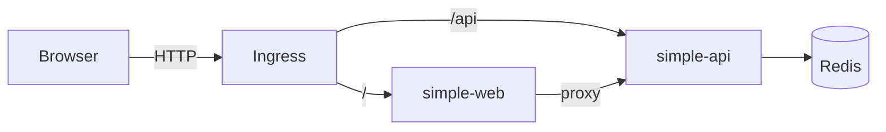

# Step 11: Mini Architecture — 複数サービスを Kubernetes 上で連携させる

## 目的

複数サービスを Kubernetes 上で連携させ、実際のアプリケーション構成に近い形を体験する。
これまで個別に学んできた Deployment、Service、Ingress、Probe、Resources、Observability を 1 つの構成にまとめ、「全体が動く」感覚を掴む。

## 学ぶこと

- サービス間通信（Service DNS を使った Pod 間の接続）
- 設定の分離（各コンポーネントを独立した YAML ファイルに分ける）
- 疎通確認の順序（下流から順に確認していく考え方）
- Ingress によるパスベースのルーティング

## 構成図



```
ブラウザ
  │
  ▼
Ingress (mini-app.local)
  ├── /        → simple-web (Nginx)
  └── /api     → simple-api (Go)
                    │
                    ▼
                  Redis
```

- **simple-web**: 静的ファイルを配信するフロントエンド
- **simple-api**: ビジネスロジックを担当する API サーバー。Redis にデータを保存する
- **Redis**: インメモリデータストア。API のセッションやキャッシュに使用する

## ディレクトリ構成

```
step11-mini-architecture/
├── README.md
├── namespace.yaml          # mini-app namespace
├── redis.yaml              # Redis Deployment + Service
├── api.yaml                # simple-api Deployment + Service
├── web.yaml                # simple-web Deployment + Service
└── ingress.yaml            # パスベースルーティング
```

## 各ファイルの解説

### namespace.yaml

アプリケーション全体を `mini-app` namespace に配置する。monitoring namespace とは分離されている。

### redis.yaml

| リソース | 説明 |
|---|---|
| `Deployment` | Redis 7 (Alpine) を 1 レプリカで起動 |
| `Service` | ClusterIP で `redis:6379` として他の Pod からアクセス可能にする |

API から `redis.mini-app.svc.cluster.local:6379`（または単に `redis:6379`）で接続できる。

### api.yaml

| 設定 | 説明 |
|---|---|
| `replicas: 2` | 可用性のために 2 レプリカ |
| `readinessProbe` | `/health` エンドポイントで準備状態を確認 |
| `resources` | CPU 100m-200m、メモリ 64Mi-128Mi |
| `prometheus.io/scrape` | Prometheus からメトリクスを収集される設定 |
| `imagePullPolicy: Never` | ローカルビルドしたイメージを使用 |

### web.yaml

| 設定 | 説明 |
|---|---|
| `replicas: 2` | 可用性のために 2 レプリカ |
| `readinessProbe` | `/` エンドポイントで準備状態を確認 |
| `resources` | CPU 50m-100m、メモリ 32Mi-64Mi |

### ingress.yaml

| パス | ルーティング先 | 説明 |
|---|---|---|
| `/` | simple-web:80 | フロントエンドへのアクセス |
| `/api` | simple-api:8080 | API へのアクセス |

`nginx.ingress.kubernetes.io/rewrite-target: /$2` により、パスの書き換えが行われる。

## 前提条件

- Step 01 〜 Step 10 を完了していること
- simple-api と simple-web のイメージがビルド済みで、kind クラスタにロードされていること

```bash
# イメージのビルドとロード（まだの場合）
docker build -t simple-api:latest ./path/to/api
docker build -t simple-web:latest ./path/to/web
kind load docker-image simple-api:latest
kind load docker-image simple-web:latest
```

## 実行手順

**デプロイの順序が重要。** 下流のコンポーネント（Redis）から順にデプロイする。

```bash
# 1. namespace を作成する
kubectl apply -f namespace.yaml

# 2. Redis をデプロイする（他のサービスが依存している）
kubectl apply -f redis.yaml

# 3. Redis が Running になるまで待つ
kubectl -n mini-app get pods -w

# 4. API をデプロイする（Redis に依存、Web から呼ばれる）
kubectl apply -f api.yaml

# 5. Web をデプロイする
kubectl apply -f web.yaml

# 6. 全 Pod が Ready になるまで待つ
kubectl -n mini-app get pods -w

# 7. Ingress を作成する
kubectl apply -f ingress.yaml

# 8. /etc/hosts にホスト名を追加する
echo "127.0.0.1 mini-app.local" | sudo tee -a /etc/hosts

# 9. ブラウザで http://mini-app.local にアクセスする
```

### デプロイ順序の考え方

```
Redis（依存なし）
  ↓
simple-api（Redis に依存）
  ↓
simple-web（API に依存）
  ↓
Ingress（Web, API の Service が存在する必要がある）
```

下流から順にデプロイすることで、各コンポーネントが起動時に依存先にアクセスできる。

## 確認方法

```bash
# 1. 全 Pod が Running / Ready であること
kubectl -n mini-app get pods
# NAME                          READY   STATUS    RESTARTS   AGE
# redis-xxxxx-xxxxx             1/1     Running   0          2m
# simple-api-xxxxx-xxxxx        1/1     Running   0          1m
# simple-api-xxxxx-yyyyy        1/1     Running   0          1m
# simple-web-xxxxx-xxxxx        1/1     Running   0          1m
# simple-web-xxxxx-yyyyy        1/1     Running   0          1m

# 2. Service の Endpoints が正しく紐づいていること
kubectl -n mini-app get endpoints
# NAME         ENDPOINTS                           AGE
# redis        10.244.0.20:6379                    2m
# simple-api   10.244.0.21:8080,10.244.0.22:8080   1m
# simple-web   10.244.0.23:80,10.244.0.24:80       1m

# 3. Ingress が正しく設定されていること
kubectl -n mini-app get ingress
# NAME               CLASS   HOSTS            ADDRESS     PORTS   AGE
# mini-app-ingress   ...     mini-app.local   localhost   80      30s

# 4. ブラウザで表示を確認
#    http://mini-app.local      → Web のトップページ
#    http://mini-app.local/api  → API のレスポンス

# 5. Pod 間の通信を確認
kubectl -n mini-app exec -it deploy/simple-api -- wget -qO- http://redis:6379 || echo "Redis接続確認"
kubectl -n mini-app exec -it deploy/simple-web -- wget -qO- http://simple-api:8080/health || echo "API接続確認"
```

## よくある失敗

| 症状 | 原因 | 対処 |
|---|---|---|
| 全部を 1 つのコンテナに詰め込んでしまう | マイクロサービスの分離ができていない | 各サービスの責務を明確にし、それぞれ独立した Deployment にする。スケール単位が異なるものは分ける |
| Web と API の責務が曖昧 | 「フロントエンド」と「バックエンド」の境界が定まっていない | Web は静的ファイル配信に専念し、API がビジネスロジックを担当する。Web から API へは HTTP でアクセスする |
| デプロイ順序を間違えて起動エラー | 依存先のサービスがまだ存在しない状態でアクセスしようとする | 下流（Redis → API → Web → Ingress）の順にデプロイする。readinessProbe があれば依存先が準備できるまで待てる |
| Endpoints が `<none>` になる | Service の selector と Pod の labels が一致していない | `kubectl describe svc` と `kubectl get pods --show-labels` で labels を突き合わせる |
| Ingress にアクセスできない | `/etc/hosts` にホスト名を追加していない、または Ingress Controller が入っていない | hosts ファイルを確認し、`kubectl get pods -n ingress-nginx` で Controller の存在を確認する |

## 本番だとどう変わるか

- **BFF (Backend for Frontend) の追加**: Web と API の間に BFF レイヤーを挟み、フロントエンド向けに最適化された API を提供する
- **データベースの追加**: Redis だけでなく PostgreSQL 等の永続データベースを追加し、StatefulSet で管理する
- **非同期処理の追加**: メッセージキュー（RabbitMQ, NATS 等）を導入し、API から非同期にジョブを処理する
- **Service Mesh**: Istio や Linkerd を導入し、サービス間の通信を暗号化（mTLS）、トラフィック制御、可観測性を強化する
- **GitOps**: マニフェストを Git リポジトリで管理し、ArgoCD 等で自動デプロイする。手動 `kubectl apply` は本番では行わない
- **Helm / Kustomize**: 環境ごとの差分を管理する仕組みを導入する

---

次のステップでは、「壊れた時に何を見るか」を体験する。正常に動いている構成をわざと壊し、ログやメトリクス、kubectl コマンドを使ってトラブルシューティングの実践に進む。Step 12 に進もう。
