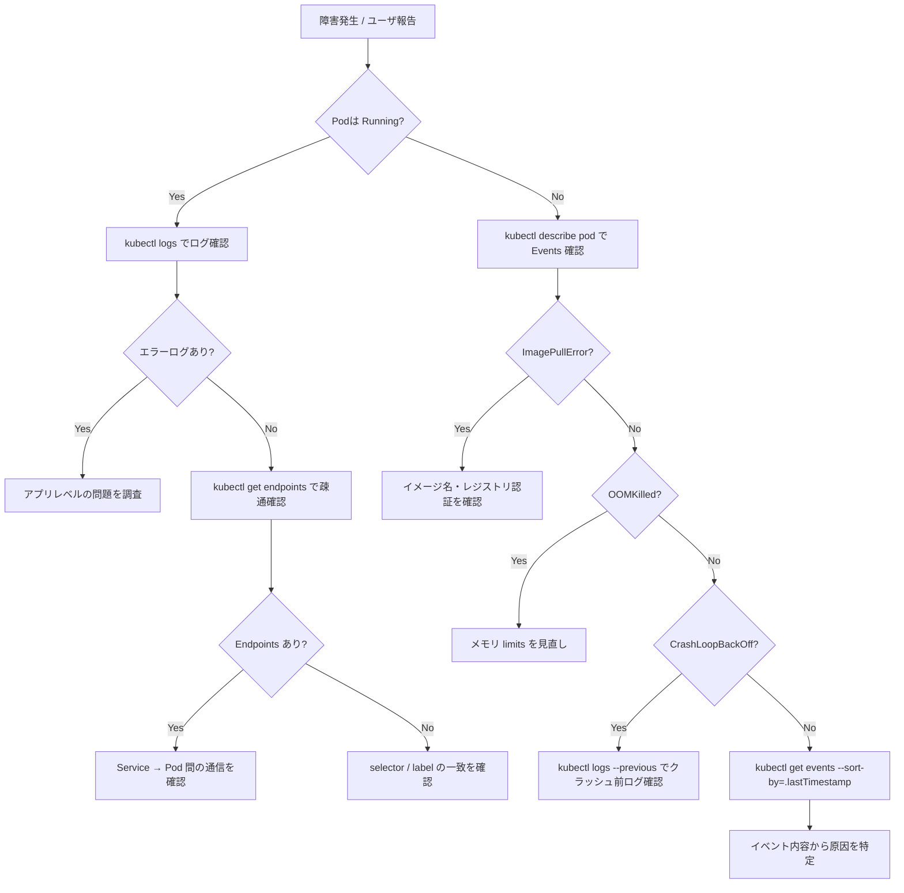

# Step 12: 障害ドリル -- 壊れた時に何を見るか

## 目的

本番環境では「動いている状態」よりも「壊れた時にどう対処するか」のほうが重要である。
このステップでは、意図的に障害を発生させ、調査から復旧までの流れを体験する。
「壊れた時に何を見るか」を体で覚えることが目的である。

## 学ぶこと

- `kubectl describe` でリソースの詳細状態を確認する方法
- `kubectl logs` でコンテナログを取得する方法
- `kubectl get events` でクラスタイベントを確認する方法
- `kubectl top` でリソース使用状況を確認する方法
- 障害の症状から原因を特定するフロー
- 復旧手順の考え方と再発防止策

## ディレクトリ構成

```
step12-failure-drill/
├── README.md              # このファイル
└── scenarios/
    ├── broken-readiness.yaml   # シナリオ2: readinessProbe失敗
    ├── broken-selector.yaml    # シナリオ3: Service selectorミス
    ├── broken-ingress.yaml     # シナリオ6: Ingress設定ミス
    └── oom-pod.yaml            # シナリオ7: OOMKill
```

## 基本的な調査フロー

障害が発生した場合、以下のフローで調査を進める。



## 実行手順

### 前提条件

Step 11 で構築した mini-app の構成が動作していること。

```bash
# 動作確認
kubectl get all -n mini-app
```

---

## シナリオ1: Pod 強制削除

### 症状

アプリケーションに一時的にアクセスできなくなる。

### 再現手順

```bash
# 現在のPod一覧を確認
kubectl get pods -n mini-app

# Pod名を取得（simple-api の例）
POD_NAME=$(kubectl get pods -n mini-app -l app=simple-api -o jsonpath='{.items[0].metadata.name}')

# Podを強制削除
kubectl delete pod $POD_NAME -n mini-app --grace-period=0 --force

# 自動復旧を監視（別ターミナルで実行推奨）
kubectl get pods -n mini-app -w
```

### 確認コマンド

```bash
# Pod の状態を継続監視
kubectl get pods -n mini-app -w

# イベントを確認
kubectl get events -n mini-app --sort-by='.lastTimestamp' | tail -10

# Deployment のステータス確認
kubectl describe deployment simple-api -n mini-app | grep -A 5 "Conditions"
```

### 原因

Podが強制終了された。`--grace-period=0 --force` は graceful shutdown を待たずに即座にPodを削除する。

### 復旧方法

Deploymentが管理しているPodであれば、ReplicaSetが自動的に新しいPodを作成するため、手動での復旧は不要。

### 再発防止策

- 本番環境では `--grace-period=0 --force` を安易に使わない
- PodDisruptionBudget（PDB）を設定し、最低稼働Pod数を保証する
- 複数レプリカを維持し、1台が落ちてもサービス継続できるようにする

### 学び

Deploymentで管理されたPodは、削除されても自動的に再作成される。
これがKubernetesの「宣言的な状態管理」の恩恵である。
逆に、Deploymentなしの素のPodは削除されたら消えたままになる。

---

## シナリオ2: readinessProbe 失敗

### 症状

Podは Running だが、Serviceからトラフィックが流れない。
ユーザからは「502 Bad Gateway」や「接続できない」と報告される。

### 再現手順

```bash
# 壊れた readinessProbe を適用
kubectl apply -f scenarios/broken-readiness.yaml

# Pod の状態を確認
kubectl get pods -n mini-app -l app=simple-api
```

### 確認コマンド

```bash
# Pod の READY 列を確認（0/1 になっているはず）
kubectl get pods -n mini-app -l app=simple-api

# Endpoints を確認（空になっているはず）
kubectl get endpoints simple-api -n mini-app

# Pod の Events で readiness probe の失敗を確認
kubectl describe pod -n mini-app -l app=simple-api | grep -A 10 "Events"

# readinessProbe の設定を確認
kubectl get deployment simple-api -n mini-app -o jsonpath='{.spec.template.spec.containers[0].readinessProbe}' | jq .
```

### 原因

readinessProbe のパスが `/healthz-nonexistent` に設定されており、ヘルスチェックが常に失敗する。
readinessProbe が失敗すると、PodはEndpointsから除外され、Serviceからトラフィックが届かなくなる。

### 復旧方法

```bash
# 正しい readinessProbe パスに戻した Deployment を再適用
# （step11 のオリジナルの Deployment を再適用する）
kubectl apply -f ../step11-multi-resource-app/manifests/api/deployment.yaml
```

### 再発防止策

- readinessProbe / livenessProbe のエンドポイントを専用に用意し、テストする
- CI/CD パイプラインでマニフェストの検証を行う
- ステージング環境で事前に動作確認する

---

## シナリオ3: Service selector ミス

### 症状

Serviceは存在するが、バックエンドPodにトラフィックが到達しない。
`curl` すると接続タイムアウトや「no endpoints available」になる。

### 再現手順

```bash
# 壊れた selector の Service を適用
kubectl apply -f scenarios/broken-selector.yaml

# Service の状態を確認
kubectl get svc simple-api -n mini-app
```

### 確認コマンド

```bash
# Endpoints を確認（<none> になっているはず）
kubectl get endpoints simple-api -n mini-app

# Service の selector を確認
kubectl describe svc simple-api -n mini-app | grep Selector

# Pod の label を確認
kubectl get pods -n mini-app --show-labels

# selector と label を比較して不一致を発見する
kubectl get svc simple-api -n mini-app -o jsonpath='{.spec.selector}' | jq .
```

### 原因

Serviceの `selector` に指定した label (`app: simple-api-typo`) が、Podの label (`app: simple-api`) と一致しない。
Serviceは selector に一致するPodだけをEndpointsに登録するため、不一致だとトラフィックが流れない。

### 復旧方法

```bash
# 正しい selector の Service を再適用
kubectl apply -f ../step11-multi-resource-app/manifests/api/service.yaml
```

### 再発防止策

- label の命名規則を統一し、ドキュメント化する
- Helm や Kustomize のテンプレートで label を自動生成する
- デプロイ後に `kubectl get endpoints` を確認するスクリプトを用意する

---

## シナリオ4: ConfigMap 値ミス

### 症状

Podは Running だが、アプリケーションが正しく動作しない。
ログにエラーが出力される。

### 再現手順

```bash
# ConfigMap の値を間違えて作成
kubectl create configmap simple-api-config \
  -n mini-app \
  --from-literal=REDIS_HOST=redis-wrong-host \
  --from-literal=REDIS_PORT=9999 \
  --dry-run=client -o yaml | kubectl apply -f -

# Pod を再起動して新しい ConfigMap を反映
kubectl rollout restart deployment simple-api -n mini-app

# Pod が起動するのを待つ
kubectl rollout status deployment simple-api -n mini-app --timeout=60s
```

### 確認コマンド

```bash
# Pod のログでエラーを確認
kubectl logs -n mini-app -l app=simple-api --tail=20

# Pod 内の環境変数を確認
kubectl exec -n mini-app deploy/simple-api -- env | grep REDIS

# ConfigMap の内容を確認
kubectl get configmap simple-api-config -n mini-app -o yaml
```

### 原因

ConfigMap に誤った Redis ホスト名・ポートが設定されており、アプリケーションが Redis に接続できない。

### 復旧方法

```bash
# 正しい値で ConfigMap を再作成
kubectl create configmap simple-api-config \
  -n mini-app \
  --from-literal=REDIS_HOST=redis \
  --from-literal=REDIS_PORT=6379 \
  --dry-run=client -o yaml | kubectl apply -f -

# Pod を再起動
kubectl rollout restart deployment simple-api -n mini-app
```

### 再発防止策

- ConfigMap の値を Git で管理し、変更をレビューする
- 環境変数のバリデーションをアプリケーション起動時に行う
- ConfigMap の変更を検知して自動で Pod を再起動する仕組み（Reloader 等）を導入する

---

## シナリオ5: Redis 停止

### 症状

APIのレスポンスがエラーになる。カウンター機能やキャッシュが動作しない。

### 再現手順

```bash
# Redis の Deployment を削除
kubectl delete deployment redis -n mini-app

# API にリクエストを送ってエラーを確認
kubectl exec -n mini-app deploy/simple-api -- wget -qO- http://localhost:3000/api/health || echo "エラー発生"
```

### 確認コマンド

```bash
# Redis の Pod が存在しないことを確認
kubectl get pods -n mini-app -l app=redis

# API のログでエラーを確認
kubectl logs -n mini-app -l app=simple-api --tail=20

# API の Pod 内から Redis への接続を試みる
kubectl exec -n mini-app deploy/simple-api -- sh -c 'nc -zv redis 6379 2>&1 || echo "Redis接続不可"'
```

### 原因

Redis の Deployment が削除され、Redis Pod が存在しない。
API は Redis に依存しているため、Redis が停止するとエラーが発生する。

### 復旧方法

```bash
# Redis を再デプロイ
kubectl apply -f ../step11-multi-resource-app/manifests/redis/

# Redis が Ready になるのを待つ
kubectl rollout status deployment redis -n mini-app --timeout=60s

# API が正常に動作することを確認
kubectl exec -n mini-app deploy/simple-api -- wget -qO- http://localhost:3000/api/health
```

### 再発防止策

- Redis を Deployment ではなく StatefulSet で運用する
- Redis Sentinel や Redis Cluster で冗長構成にする
- 本番では Amazon ElastiCache / Google Memorystore 等のマネージドサービスを使う
- アプリケーション側で Redis 障害時のフォールバック処理を実装する

### 学び

依存サービスの停止は、それに依存するすべてのサービスに波及する（カスケード障害）。
マイクロサービスアーキテクチャでは、依存関係の把握とフォールバック設計が重要である。

---

## シナリオ6: Ingress 設定ミス

### 症状

ブラウザからアクセスすると 503 Service Unavailable や 404 Not Found が返る。

### 再現手順

```bash
# backend の Service 名が間違った Ingress を適用
kubectl apply -f scenarios/broken-ingress.yaml
```

### 確認コマンド

```bash
# Ingress の状態を確認
kubectl describe ingress -n mini-app

# backend の Service が解決されているか確認
kubectl get ingress -n mini-app -o yaml

# 指定された Service 名が存在するか確認
kubectl get svc -n mini-app

# Ingress Controller のログを確認
kubectl logs -n ingress-nginx -l app.kubernetes.io/component=controller --tail=20
```

### 原因

Ingress の `backend.service.name` に存在しない Service 名（`simple-api-typo`）が指定されている。
Ingress Controller が対応するバックエンドを見つけられず、リクエストをルーティングできない。

### 復旧方法

```bash
# 正しい Ingress を再適用
kubectl apply -f ../step11-multi-resource-app/manifests/ingress.yaml
```

### 再発防止策

- Ingress の定義で Service 名をハードコードせず、Helm 等で変数化する
- デプロイ後に自動で疎通確認を行うスクリプトを用意する
- `kubectl describe ingress` の結果を CI/CD で検証する

---

## シナリオ7: OOMKill

### 症状

Pod が `OOMKilled` ステータスで繰り返し再起動する（CrashLoopBackOff）。

### 再現手順

```bash
# OOM を起こす Pod をデプロイ
kubectl apply -f scenarios/oom-pod.yaml

# Pod の状態を監視
kubectl get pods -n mini-app oom-demo -w
```

### 確認コマンド

```bash
# Pod の状態を確認（OOMKilled が表示される）
kubectl describe pod oom-demo -n mini-app | grep -A 5 "Last State"

# Pod の終了理由を確認
kubectl get pod oom-demo -n mini-app -o jsonpath='{.status.containerStatuses[0].lastState.terminated.reason}'

# ノードのイベントを確認
kubectl get events -n mini-app --field-selector involvedObject.name=oom-demo --sort-by='.lastTimestamp'

# メモリ使用量を確認（metrics-server が必要）
kubectl top pod -n mini-app
```

### 原因

コンテナが `resources.limits.memory: 32Mi` の制限を超えてメモリを使用しようとしたため、
カーネルの OOM Killer によってプロセスが強制終了された。

### 復旧方法

```bash
# OOM デモ Pod を削除
kubectl delete pod oom-demo -n mini-app

# 本来の対処: メモリ limits を適切な値に設定する
# または、アプリケーションのメモリ使用量を最適化する
```

### 再発防止策

- 事前に負荷テストを行い、アプリケーションの実メモリ使用量を把握する
- `resources.requests` と `resources.limits` を適切に設定する
- メモリリークの検出ツール（profiler 等）を使う
- Prometheus + Alertmanager でメモリ使用率のアラートを設定する

---

## 確認方法

すべてのシナリオを順番に実施し、以下ができたか確認する。

```bash
# 各シナリオの確認チェックリスト:
# 1. 症状を正しく認識できたか
# 2. 適切な kubectl コマンドで原因を特定できたか
# 3. 復旧手順を実行して正常状態に戻せたか
# 4. なぜその障害が起きたか説明できるか

# 最終確認: step11 の構成が正常に動作していること
kubectl get all -n mini-app
kubectl get endpoints -n mini-app
kubectl get ingress -n mini-app
```

## よくある失敗

| 症状 | 原因 | 対処 |
|------|------|------|
| `kubectl delete` しても Pod が消えない | finalizer が設定されている | `kubectl edit` で finalizer を削除 |
| `kubectl logs` でログが見れない | Pod が CrashLoopBackOff | `kubectl logs --previous` で前回のログを見る |
| `kubectl exec` ができない | Pod が Running でない | まず Pod の状態を Running にする |
| `kubectl top` で metrics が取れない | metrics-server が未インストール | `kubectl apply -f` で metrics-server をインストール |
| OOM Pod が再起動し続ける | restartPolicy が Always（デフォルト） | `kubectl delete pod` で削除する |
| Ingress 修正後も 503 が続く | ブラウザキャッシュ / Ingress Controller の反映遅延 | シークレットウィンドウで確認、しばらく待つ |
| シナリオ実施後に元に戻せない | 復旧用の YAML を把握していない | step11 のマニフェストを再適用する |

## 本番だとどう変わるか

| 観点 | 学習環境（kind） | 本番環境 |
|------|-----------------|---------|
| 障害検知 | 手動で `kubectl` を実行 | Prometheus + Alertmanager で自動通知 |
| ログ確認 | `kubectl logs` で個別に確認 | Loki / Elasticsearch で集約・検索 |
| 復旧手順 | 手動で `kubectl apply` | Runbook + 自動復旧スクリプト |
| 再発防止 | README に記録 | ポストモーテム文書 + 改善チケット |
| 障害対応 | 一人で実施 | オンコール体制 + エスカレーションフロー |
| 影響範囲 | ローカル環境のみ | ユーザ影響あり、SLA に関わる |
| OOM対策 | limits を手動調整 | VPA（Vertical Pod Autoscaler）で自動調整 |
| Redis障害 | 手動で再デプロイ | Redis Sentinel / ElastiCache で自動フェイルオーバー |

本番環境では、障害ドリルを定期的に実施する「ゲームデー」という文化がある。
Netflix の Chaos Monkey のように、意図的に障害を注入するツール（Chaos Engineering）も活用される。

---

## 次のステップ

ここまでで「壊して直す」経験を積んだ。障害は怖くない -- 調査の手順を知っていれば対処できる。
次の Step 13 では、ここまで構築してきた構成全体を「アーキテクチャレビュー」の視点で批評する。
「動いているけど本番に耐えられるか?」という問いに向き合い、設計力を高めていく。
