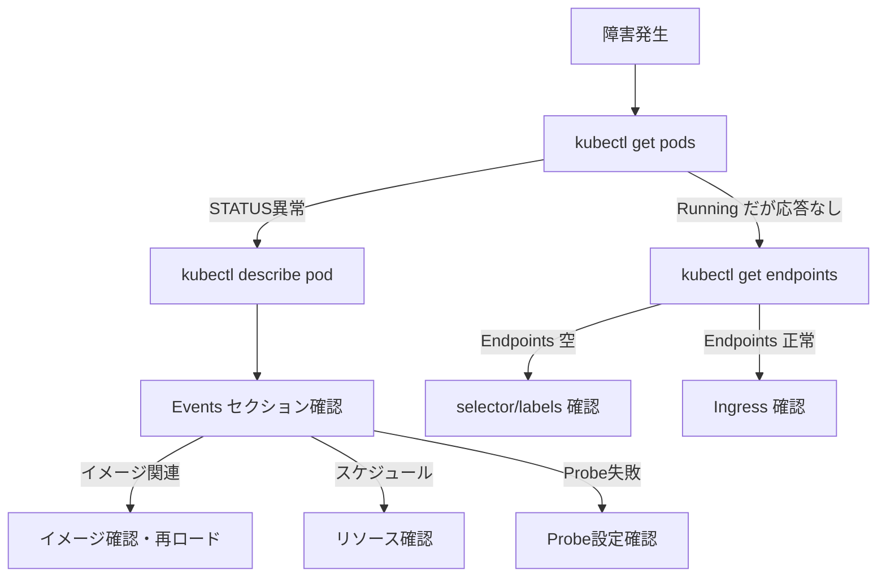

# Step 12: 障害再現ドリル

## 目的

「壊れた時に何を見るか」を体験する。

Kubernetesを運用していると、必ず障害は起きます。そのときに慌てず対応するためには、**事前に障害を体験しておく**ことが最も効果的です。このステップでは、意図的に障害を起こし、調査→原因特定→復旧のプロセスを身に付けます。

---

## 学ぶこと

- `kubectl describe` / `logs` / `events` を使った障害調査
- 各リソースの壊れ方パターン
- 調査の順序と切り分けの考え方
- 復旧と再発防止

---

## 基本的な調査フロー



---

## 前提

- Step11のミニ構成（mini-app namespace）がデプロイ済み
- `kubectl get pods -n mini-app` で全Podが Running であること

---

## ディレクトリ構成

```
step12-failure-drill/
├── README.md
└── scenarios/
    ├── broken-readiness.yaml
    ├── broken-selector.yaml
    ├── broken-ingress.yaml
    └── oom-pod.yaml
```

---

## シナリオ1: Pod強制削除

### 症状
Podが突然消える。

### 再現手順
```bash
# 現在のPod一覧を確認
kubectl get pods -n mini-app

# APIのPodを1つ強制削除
kubectl delete pod -n mini-app -l app=simple-api --field-selector=status.phase=Running --grace-period=0 --force 2>/dev/null | head -1

# または特定のPod名を指定
kubectl get pods -n mini-app -l app=simple-api -o name | head -1 | xargs kubectl delete -n mini-app --grace-period=0 --force
```

### 確認コマンド
```bash
# リアルタイムで復旧を観察
kubectl get pods -n mini-app -w
```

### 原因
Podが削除された。

### 復旧方法
Deploymentが管理しているPodは**自動復旧**する。数秒で新しいPodが起動する。

### 再発防止策
- Deploymentを使う（Pod直打ちしない）
- replicas を 2 以上にする
- PodDisruptionBudget を設定する

### 学び
**DeploymentがあればPodは自動復旧する。** だからこそ、Pod直打ちではなくDeploymentを使うことが重要。

---

## シナリオ2: readinessProbe失敗

### 症状
Podは Running だがトラフィックが来ない。

### 再現手順
```bash
# 壊れたreadiness probeを適用
kubectl apply -f scenarios/broken-readiness.yaml
```

### 確認コマンド
```bash
# READY が 0/1 になっていることを確認
kubectl get pods -n mini-app -l app=simple-api

# Endpointsが空になっていることを確認
kubectl get endpoints simple-api -n mini-app

# Podの詳細でProbe失敗イベントを確認
kubectl describe pod -n mini-app -l app=simple-api | grep -A5 "Readiness"
kubectl describe pod -n mini-app -l app=simple-api | tail -20
```

### 原因
readinessProbeのパスが `/healthz`（存在しない）に設定されている。

### 復旧方法
```bash
# 正しいDeploymentを再適用（Step11のapi.yaml）
kubectl apply -f ../step11-mini-architecture/api.yaml
```

### 再発防止策
- Probe のパスをアプリの実際のエンドポイントに合わせる
- CI/CD でマニフェストのバリデーションを行う

---

## シナリオ3: Service selectorミス

### 症状
Serviceにアクセスしても応答がない。

### 再現手順
```bash
kubectl apply -f scenarios/broken-selector.yaml
```

### 確認コマンド
```bash
# Endpoints が <none> になっている
kubectl get endpoints broken-api-svc -n mini-app

# Serviceのselectorを確認
kubectl get svc broken-api-svc -n mini-app -o yaml | grep -A3 selector

# Podのlabelsと比較
kubectl get pods -n mini-app --show-labels
```

### 原因
Serviceのselectorが `app: simple-api-typo` になっている（正しくは `app: simple-api`）。

### 復旧方法
```bash
# 壊れたServiceを削除
kubectl delete -f scenarios/broken-selector.yaml
```

### 再発防止策
- selector と labels の整合性をレビューで確認
- `kubectl get endpoints` を習慣にする

---

## シナリオ4: ConfigMap値ミス

### 症状
アプリが想定外の動作をする、またはエラーを返す。

### 再現手順
```bash
# 間違った値のConfigMapを作成
kubectl create configmap broken-config \
  --from-literal=APP_ENV=INVALID_VALUE \
  --from-literal=LOG_LEVEL=XXXXX \
  -n mini-app --dry-run=client -o yaml | kubectl apply -f -

# アプリの環境変数を確認
kubectl exec -n mini-app deploy/simple-api -- env | grep APP_ENV
```

### 確認コマンド
```bash
# ConfigMapの値を確認
kubectl get configmap broken-config -n mini-app -o yaml

# アプリのログでエラーを確認
kubectl logs -n mini-app -l app=simple-api
```

### 原因
ConfigMapの値が間違っている。

### 復旧方法
```bash
# ConfigMapを修正
kubectl delete configmap broken-config -n mini-app
```

### 再発防止策
- 設定値のバリデーション
- デプロイ後のスモークテスト
- ConfigMapの変更をGit管理する

---

## シナリオ5: Redis停止

### 症状
APIのレスポンスが変わる（Redisに依存する機能がエラー）。

### 再現手順
```bash
# Redisを停止
kubectl delete deployment redis -n mini-app
kubectl delete svc redis -n mini-app
```

### 確認コマンド
```bash
# APIにアクセスしてレスポンスを確認
kubectl exec -n mini-app deploy/simple-api -- wget -qO- http://localhost:8080/health

# APIのログを確認
kubectl logs -n mini-app -l app=simple-api
```

### 原因
依存サービス（Redis）が停止。

### 復旧方法
```bash
# Redisを再デプロイ
kubectl apply -f ../step11-mini-architecture/redis.yaml
```

### 再発防止策
- 依存サービスの死活監視
- サーキットブレーカーパターン
- Redisのreplica構成（Sentinel/Cluster）
- ヘルスチェックに依存サービスの確認を含める

### 学び
**マイクロサービスでは、依存サービスの障害が自サービスに波及する。** 依存関係を把握し、障害時の挙動を設計段階で考えておくことが重要。

---

## シナリオ6: Ingress設定ミス

### 症状
ブラウザからアクセスしても 404 や 503 が返る。

### 再現手順
```bash
kubectl apply -f scenarios/broken-ingress.yaml
```

### 確認コマンド
```bash
# Ingressの詳細を確認
kubectl describe ingress broken-ingress -n mini-app

# backendのService/Endpointsを確認
kubectl get svc -n mini-app
kubectl get endpoints -n mini-app
```

### 原因
IngressのbackendのService名が `simple-api-wrong`（存在しない）に設定されている。

### 復旧方法
```bash
kubectl delete -f scenarios/broken-ingress.yaml
```

### 再発防止策
- IngressのbackendがServiceに正しくマッピングされているか確認
- `kubectl describe ingress` でbackendの状態を確認する習慣

---

## シナリオ7: OOMKill（メモリ超過）

### 症状
Podが再起動を繰り返す。STATUSが `OOMKilled` になる。

### 再現手順
```bash
kubectl apply -f scenarios/oom-pod.yaml

# 数秒待つ
sleep 10
```

### 確認コマンド
```bash
# STATUSを確認
kubectl get pod oom-demo -n mini-app

# 詳細でOOMKilledを確認
kubectl describe pod oom-demo -n mini-app | grep -A5 "Last State"
kubectl describe pod oom-demo -n mini-app | grep -i oom
```

### 原因
コンテナのメモリ使用量が `limits.memory: 32Mi` を超過した。

### 復旧方法
```bash
# OOMデモPodを削除
kubectl delete -f scenarios/oom-pod.yaml

# 実際のアプリでは limits を適切に引き上げる
# ただし、メモリリークの可能性も調査すること
```

### 再発防止策
- 適切な `resources.limits.memory` の設定
- メモリ使用量の監視（Prometheus/Grafana）
- メモリリークの定期的な調査
- ストレステストでの限界値把握

---

## まとめ

| シナリオ | 最初に見るべきもの | キーコマンド |
|----------|-------------------|-------------|
| Pod消失 | `kubectl get pods -w` | Deployment が復旧する |
| readiness失敗 | `kubectl get endpoints` | READY 0/1 を確認 |
| selector不一致 | `kubectl get endpoints` | Endpoints: `<none>` |
| ConfigMapミス | `kubectl exec -- env` | 値を直接確認 |
| 依存サービス停止 | `kubectl logs` | エラーログ確認 |
| Ingressミス | `kubectl describe ingress` | backend状態確認 |
| OOMKill | `kubectl describe pod` | Last State: OOMKilled |

---

## よくある失敗

- `kubectl get pods` だけで調査を終わらせる（describe/logs/eventsを見ない）
- 障害の証拠を消してしまう（ログを見る前にPodを消す）
- 一度に複数の修正をする（何が原因だったか分からなくなる）

---

## 本番だとどう変わるか

- **ログ集約**: kubectl logs ではなく、CloudWatch Logs / Loki / Datadog で検索
- **メトリクス**: kubectl top ではなく、Prometheus + Grafana / CloudWatch でダッシュボード
- **アラート**: 人間が気づく前にアラートが飛ぶ（Alertmanager / PagerDuty）
- **インシデント管理**: 発生→調査→復旧→ポストモーテムのフロー
- **カオスエンジニアリング**: Chaos Mesh / Litmus で定期的に障害を注入

---

## 次のステップ

ここまでで「壊す→調べる→直す」の基本サイクルを体験しました。Step13では、今まで構築してきた構成を**批評的な目で見る**アーキテクチャレビューに取り組みます。「動く」と「良い」は違うということを体感しましょう。
