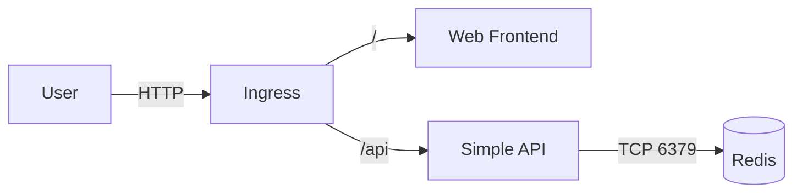
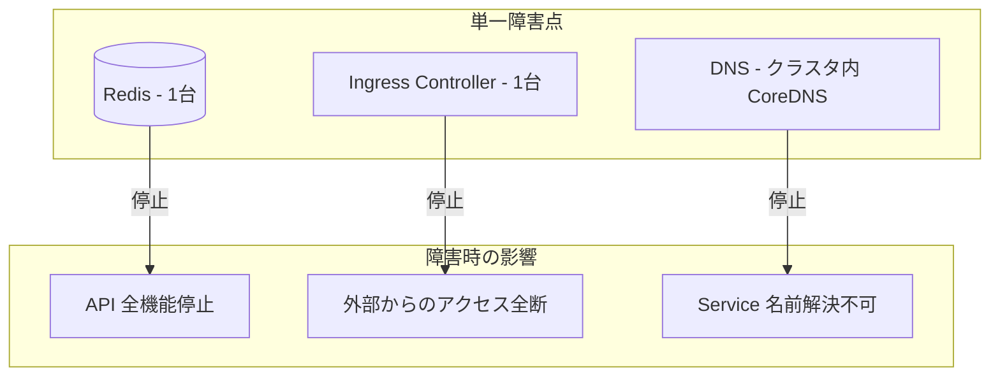
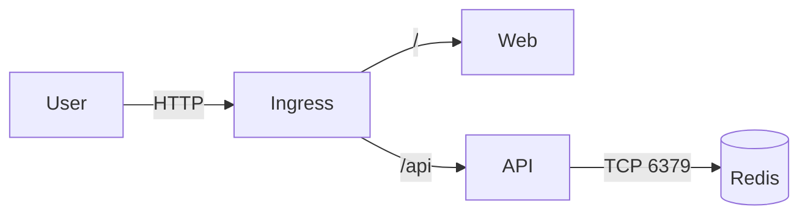
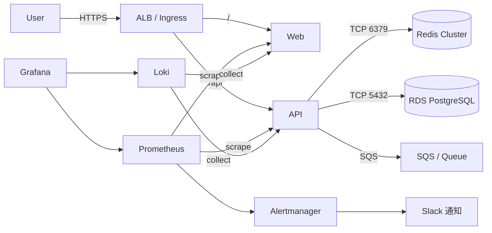

# Step 13: アーキテクチャレビュー -- 「動く構成」を批評する

## 目的

Step 11 で構築した「動く構成」を対象に、本番運用の視点でレビューを行う。
「動いている」ことと「本番で耐えられる」ことは全く別物である。
設計上の問題点を洗い出し、具体的な改善案を考えることで、設計力を高めることが目的である。

## 学ぶこと

- アーキテクチャレビューの視点と進め方
- 可用性・スケーラビリティ・セキュリティ・運用性の評価軸
- 単一障害点（SPOF）の特定方法
- 学習構成と本番構成のギャップの理解
- 改善案の優先度付け

## ディレクトリ構成

```
step13-architecture-review/
├── README.md              # このファイル
├── review-template.md     # 汎用レビューテンプレート
└── before-after.md        # 改善前後の比較表
```

## 実行手順

### Step 1: 現在の構成を把握する

まず、Step 11 で構築した構成を確認する。

```bash
# 全リソースの一覧
kubectl get all -n mini-app

# ConfigMap / Secret
kubectl get configmap,secret -n mini-app

# Ingress
kubectl get ingress -n mini-app

# リソース使用状況
kubectl top pods -n mini-app
```

### Step 2: 現在の構成図を描く



この構成の特徴:
- コンポーネントは Web / API / Redis の3つ
- Ingress でパスベースルーティング
- API が Redis に依存
- Web/API は 2 レプリカ、Redis は単一レプリカ（学習環境のため）

---

## 現在構成の問題点

### 可用性の問題

- **Redis が単一 Pod（SPOF）**: Redis が落ちると API 全体が機能停止する
- **レプリカ数が不十分**: Web/API は 2 レプリカあるが、Redis は 1 台構成。Redis が落ちるとカウンター機能が停止
- **PodDisruptionBudget 未設定**: ノードメンテナンス時にすべての Pod が同時に退避される可能性がある
- **ヘルスチェックが不十分**: readinessProbe / livenessProbe の設計が最低限

### セキュリティの問題

- **Secret が base64 のみ**: base64 は暗号化ではない。Git に入ると平文と同じ
- **コンテナが root で実行**: コンテナ内で root 権限が不要な場合でもデフォルトで root 実行
- **ネットワークポリシー未設定**: すべての Pod 間で無制限に通信可能
- **イメージの脆弱性スキャンなし**: 使用しているイメージに既知の脆弱性がある可能性
- **RBAC 最小権限原則が守られていない**: ServiceAccount に過剰な権限が付与されている可能性

### 運用の問題

- **監視アラートなし**: 障害が発生しても通知されない
- **ログ集約なし**: 各 Pod のログを個別に `kubectl logs` で確認する必要がある
- **バックアップなし**: Redis のデータが消えても復旧できない
- **デプロイパイプラインなし**: 手動で `kubectl apply` している
- **ロールバック手順未整備**: 問題発生時の切り戻し手順がない

### リソース管理の問題

- **resources.limits が適当**: 実際の使用量に基づかない値が設定されている
- **HPA 未設定**: 負荷に応じた自動スケールがない
- **LimitRange / ResourceQuota 未設定**: namespace レベルのリソース制限がない

---

## スケール時の懸念

### 水平スケールの容易さ

| コンポーネント | 水平スケール | 課題 |
|-------------|------------|------|
| Web Frontend | 容易 | 静的ファイル配信のため、レプリカを増やすだけ |
| Simple API | 比較的容易 | ステートレスであればレプリカを増やすだけ |
| Redis | 困難 | ステートフルであり、データの整合性を考慮する必要がある |

### 具体的な懸念事項

- **API の水平スケールは容易だが、Redis / WebSocket はステートフル**: 単純にレプリカを増やせない
- **セッション親和性の問題**: WebSocket やセッションを使う場合、同じクライアントが同じ Pod に接続し続ける必要がある
- **DB コネクションプール枯渇**: API レプリカ数 x コネクション数が DB の上限を超える可能性がある
- **Ingress Controller のボトルネック**: 全トラフィックが単一の Ingress Controller を通過する

---

## 単一障害点（SPOF）の特定



- **Redis**: 1台構成のため、障害 = データ消失 + API 機能停止
- **Ingress Controller**: 外部からの全トラフィックの入り口。停止するとサービス全断
- **DNS（CoreDNS）**: Service の名前解決に必要。停止すると Pod 間通信が不可能に

---

## セキュリティ上の懸念

| 懸念 | 現状 | リスク | 対策 |
|------|------|--------|------|
| Secret 管理 | base64 エンコードのみ | Git に入ると平文同然 | Sealed Secrets / External Secrets Operator / Vault |
| コンテナ実行ユーザ | root で実行 | コンテナ脱出時にホスト権限奪取 | `securityContext.runAsNonRoot: true` |
| ネットワークポリシー | 未設定 | Pod 間の無制限通信 | NetworkPolicy で最小限の通信のみ許可 |
| イメージスキャン | 未実施 | 既知脆弱性のあるイメージ使用 | Trivy / Snyk でスキャン |
| Pod Security Standards | 未設定 | 特権コンテナの起動が可能 | PodSecurity admission controller で制限 |
| RBAC | デフォルト設定 | 過剰な権限 | ServiceAccount ごとに最小権限を設定 |

---

## 運用上の懸念

| 懸念 | 現状 | 本番で起きること | 対策 |
|------|------|----------------|------|
| ログ集約 | `kubectl logs` で個別確認 | 複数 Pod のログを横断検索できない | Loki / Elasticsearch + Fluentd |
| アラート | なし | 障害に気づけない | Prometheus + Alertmanager |
| デプロイパイプライン | 手動 `kubectl apply` | 人的ミスによる障害 | ArgoCD / GitHub Actions |
| ロールバック | 手動で前のマニフェストを適用 | 復旧に時間がかかる | `kubectl rollout undo` + GitOps |
| バックアップ | なし | データ消失 | Redis RDB/AOF + S3 バックアップ |
| 証明書管理 | なし（HTTP） | 通信盗聴 | cert-manager + Let's Encrypt |

---

## 改善案

### 優先度 高（すぐ対応すべき）

1. **Redis の冗長化**
   - Redis Sentinel または Redis Cluster を導入
   - 本番では ElastiCache / Memorystore 等のマネージドサービスを使う

2. **Secret の暗号化**
   - Sealed Secrets を導入し、暗号化された Secret を Git 管理する
   - または External Secrets Operator で AWS Secrets Manager 等と連携する

3. **ネットワークポリシーの設定**
   - API → Redis のみ許可、それ以外の Pod 間通信を拒否する

### 優先度 中（段階的に対応）

4. **監視・アラートの導入**
   - Prometheus + Grafana でメトリクス可視化
   - Alertmanager で Slack / PagerDuty に通知

5. **コンテナセキュリティの強化**
   - `runAsNonRoot: true` の設定
   - `readOnlyRootFilesystem: true` の設定
   - `allowPrivilegeEscalation: false` の設定

6. **CI/CD パイプラインの構築**
   - GitHub Actions でビルド・テスト・デプロイを自動化
   - ArgoCD で GitOps ベースのデプロイに移行

### 優先度 低（余裕があれば対応）

7. **HPA / VPA の設定**
   - 負荷に応じた自動スケールを設定する

8. **PodDisruptionBudget の設定**
   - ノードメンテナンス時の可用性を保証する

9. **イメージスキャンの導入**
   - CI パイプラインに Trivy を組み込む

---

## 改善前後の構成図

### Before（現在の学習構成）



### After（本番想定の改善構成）



改善後の構成では以下が追加されている:
- **ALB**: マネージドロードバランサーで可用性を確保
- **Redis Cluster**: 冗長構成でデータの永続性と可用性を確保
- **RDS**: マネージドデータベースでバックアップ・フェイルオーバーを自動化
- **SQS**: 非同期処理でサービス間の結合度を下げる
- **Prometheus + Alertmanager**: メトリクス収集とアラート通知
- **Loki + Grafana**: ログ集約と可視化

---

## 確認方法

以下の観点で自分の構成をレビューできたか確認する。

```bash
# 1. 全リソースの一覧を出力できるか
kubectl get all -n mini-app -o wide

# 2. 各 Pod のリソース使用状況を確認できるか
kubectl top pods -n mini-app

# 3. SPOF を3つ以上挙げられるか
# → Redis, Ingress Controller, DNS

# 4. セキュリティ上の懸念を3つ以上挙げられるか
# → Secret平文管理, root実行, ネットワークポリシー未設定

# 5. 改善案に優先度を付けられるか
# → 上記の「改善案」セクションを参照
```

## よくある失敗

| 症状 | 原因 | 対処 |
|------|------|------|
| 問題点が見つからない | レビュー観点が不足 | review-template.md のチェックリストを使う |
| 改善案が抽象的すぎる | 具体的な技術を知らない | 各改善案で使うツール名まで調べる |
| 全部一度に改善しようとする | 優先度付けができていない | リスクの大きさ x 対応コストで優先度を決める |
| 本番との違いがわからない | 本番環境の経験がない | before-after.md の比較表を参照する |

## 本番だとどう変わるか

| 観点 | 学習環境（kind） | 本番環境 |
|------|-----------------|---------|
| レビュータイミング | 学習完了時に1回 | 設計時 + 定期的（四半期等） |
| レビュー参加者 | 自分1人 | SRE + 開発者 + セキュリティチーム |
| レビュー成果物 | README に記録 | ADR（Architecture Decision Record） |
| 改善の実施 | 手動で修正 | チケット化して計画的に実施 |
| セキュリティ評価 | チェックリストベース | 脅威モデリング + ペネトレーションテスト |
| キャパシティプランニング | なし | 負荷テスト結果に基づく見積もり |

---

## 次のステップ

ここまでで、Kubernetes上でアプリケーションを構築し、障害対応を経験し、アーキテクチャを批評する力を身につけた。
Step 11〜13 の流れは「構築 → 破壊 → 評価」という実践的なサイクルであり、これは本番運用でも繰り返される。
次のステップでは、kind のローカル環境から EKS 等の実クラウド環境への移行を考えていく。
