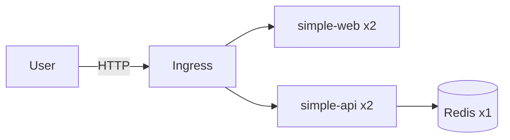
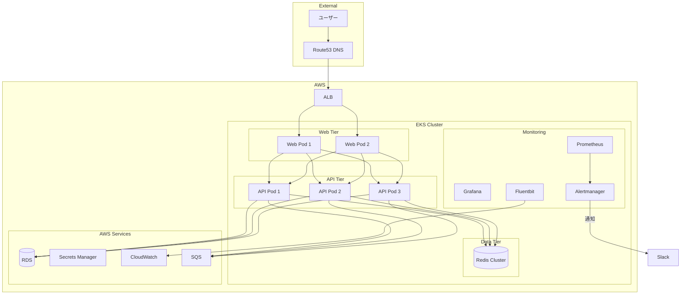

# Step 13: アーキテクチャレビュー

## 目的

「動く構成」を批評し、改善案を考える。

YAMLが書けて、`kubectl apply` で動かせるようになったのは素晴らしいことです。しかし、**「動く」と「良い設計」は別物**です。このステップでは、Step11で構築したミニ構成を題材に、アーキテクチャの問題点を洗い出し、改善案を考えます。

---

## 学ぶこと

- アーキテクチャレビューの観点
- 構成の弱点を見抜く力
- 改善の優先順位付け
- 本番を見据えた設計思考

---

## ディレクトリ構成

```
step13-architecture-review/
├── README.md
├── review-template.md
└── before-after.md
```

---

## 現在の構成（Step11のミニ構成）



---

## 現在構成の問題点

### 1. 可用性の問題

- **Redisが単一Pod（SPOF: Single Point of Failure）**
  - Redis が落ちると、APIの機能に影響する
  - データのバックアップがない
  - 復旧に手動操作が必要

- **Ingress Controllerが単一**
  - Controller自体が落ちると全サービスにアクセス不能

### 2. スケール時の懸念

- APIの水平スケールは容易（stateless）
- Redisはステートフルなため単純にreplica増やせない
- WebSocket接続はステートフル → Podを増やすだけでは解決しない
- DBを追加した場合のコネクションプール枯渇リスク

### 3. 単一障害点

| コンポーネント | SPOF？ | 影響範囲 |
|---------------|--------|---------|
| Redis | はい | API全体 |
| Ingress Controller | はい | 全サービス |
| DNS | はい | 全外部アクセス |
| Control Plane (kind) | はい | クラスタ全体 |

### 4. セキュリティ上の懸念

- **Secretがbase64のみ**（暗号化されていない）
- **コンテナがroot実行**（securityContext未設定）
- **ネットワークポリシー未設定**（全Pod間が自由に通信可能）
- **イメージの脆弱性スキャンなし**
- **RBAC最小権限原則が守られていない**

### 5. 運用上の懸念

- **ログ集約なし** → 各Pod個別にログを見るしかない
- **アラートなし** → 障害に気づけない
- **デプロイパイプラインなし** → 手動 `kubectl apply`
- **ロールバック手順未整備**
- **バックアップなし**

---

## 改善案

### 可用性の改善

| 問題 | 改善案 |
|------|--------|
| Redis SPOF | Redis Sentinel or Redis Cluster構成 |
| Ingress SPOF | Ingress Controller の replica=2以上 |
| 単一AZ | マルチAZ構成（EKS） |

### セキュリティの改善

| 問題 | 改善案 |
|------|--------|
| Secret平文 | External Secrets + AWS Secrets Manager |
| root実行 | securityContext: runAsNonRoot: true |
| Network Policy無し | NetworkPolicy でPod間通信を制限 |
| イメージ脆弱性 | Trivy / Snyk でスキャン |
| RBAC | 最小権限のServiceAccount |

### 運用の改善

| 問題 | 改善案 |
|------|--------|
| ログ集約無し | Fluentbit → CloudWatch Logs / Loki |
| アラート無し | Alertmanager + Slack/PagerDuty |
| 手動デプロイ | GitOps (ArgoCD / Flux) |
| ロールバック | Deployment rollback + CI/CD連携 |
| バックアップ | Velero / CronJob |

---

## 改善後の構成図



---

## 実行手順（レビュー演習）

このステップはコードを書くのではなく、**考える**ステップです。

1. `review-template.md` を開く
2. Step11の構成を対象にテンプレートを埋める
3. `before-after.md` を参考に、改善前後の差を理解する
4. 自分なりの改善案を考えてみる

### 演習問題

以下の質問に答えてみてください：

1. **Redisが落ちた場合、APIはどうなるべきか？**
   - エラーを返す？キャッシュなしで動く？フォールバック？

2. **同時に100人がアクセスした場合、どこがボトルネックになるか？**

3. **新しいバージョンをデプロイするとき、ダウンタイムをゼロにするには？**

4. **不正なリクエストからシステムを守るには？**

5. **このシステムの月額コストをAWSで見積もると？**

---

## 確認方法

- review-template.md を自分の言葉で埋められたか
- 最低5つの問題点を指摘できたか
- 各問題に対する改善案を考えられたか
- 改善の優先順位を付けられたか

---

## よくある失敗

- 「動いているから大丈夫」と思考停止する
- セキュリティを後回しにする
- コストを考慮しない改善案を出す
- すべてを一度に改善しようとする（優先順位が重要）
- 改善案だけ出して実現可能性を考えない

---

## 本番だとどう変わるか

- **定期的なアーキテクチャレビュー**が行われる
- **ADR（Architecture Decision Records）** で設計判断を記録する
- **脅威モデリング**でセキュリティリスクを洗い出す
- **Well-Architected Framework** に沿ったレビュー
- **コストの可視化と最適化**が継続的に行われる

---

## 次のステップ

Step13で「kind構成の限界」が見えたところで、Step14ではいよいよ**EKSへの移行**を考えます。kindで通るものとクラウドで違うものは何か、何を変えなければならないかを具体的に学びます。
