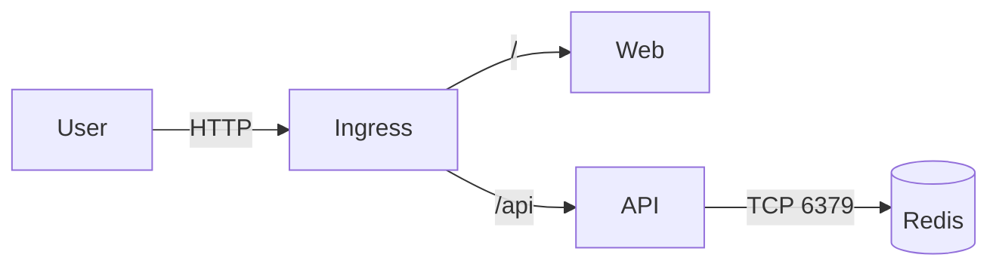
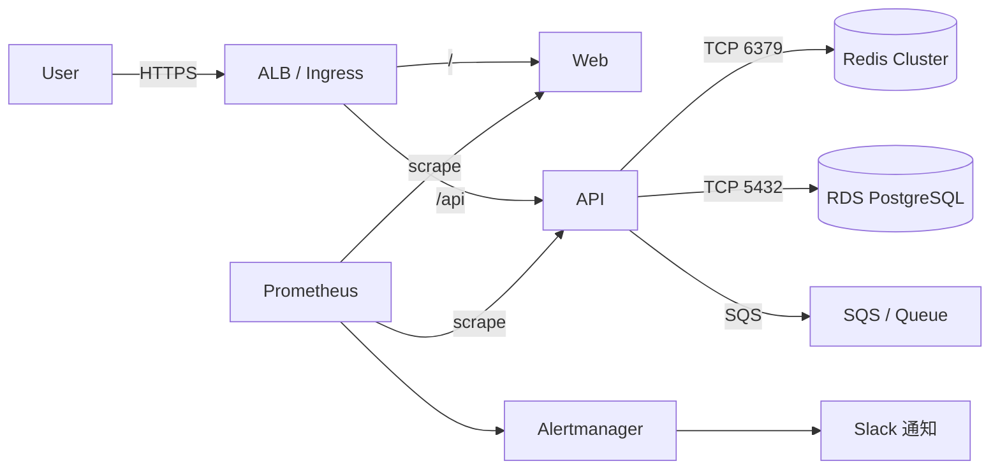

# Before / After 比較表

Step 11 のミニ構成（Before）と、本番想定の改善構成（After）を比較する。

---

## 構成図の比較

### Before（現在の kind 学習構成）

### After（本番想定の改善構成）

---

## 詳細比較表

| # | 観点 | 現在（kind 学習構成） | 改善後（本番想定） |
|---|------|---------------------|-------------------|
| 1 | ロードバランサー | NGINX Ingress Controller（kind内） | AWS ALB / NLB（マネージド、冗長化済み） |
| 2 | TLS/SSL | なし（HTTP のみ） | cert-manager + Let's Encrypt で自動更新、または ACM |
| 3 | DNS | /etc/hosts に手動設定 | Route 53 / Cloud DNS でドメイン管理 |
| 4 | API サーバ | Deployment 2レプリカ | Deployment 3レプリカ以上 + HPA（CPU/メモリベース） |
| 5 | Web フロントエンド | Deployment 2レプリカ | Deployment 2レプリカ以上 + CDN（CloudFront）でキャッシュ |
| 6 | Redis | 単一 Pod（Deployment） | ElastiCache（Redis Cluster モード、Multi-AZ） |
| 7 | データベース | なし（Redis のみ） | RDS PostgreSQL（Multi-AZ、自動バックアップ） |
| 8 | Secret 管理 | base64 エンコードの Secret | AWS Secrets Manager + External Secrets Operator |
| 9 | ConfigMap 管理 | 手動で kubectl apply | Git 管理 + ArgoCD で自動同期 |
| 10 | ネットワークポリシー | なし（全 Pod 間通信可能） | NetworkPolicy で最小限の通信のみ許可 |
| 11 | コンテナセキュリティ | root 実行、制限なし | 非 root 実行、readOnlyRootFilesystem、capability drop |
| 12 | 監視 | なし | Prometheus + Grafana（ダッシュボード + SLI/SLO） |
| 13 | アラート | なし | Alertmanager → Slack / PagerDuty |
| 14 | ログ集約 | kubectl logs で個別確認 | Loki / Elasticsearch + Fluentd/Fluent Bit |
| 15 | デプロイ方式 | 手動 kubectl apply | GitHub Actions + ArgoCD（GitOps） |
| 16 | ロールバック | 手動で前のマニフェストを適用 | ArgoCD の自動 Sync + kubectl rollout undo |
| 17 | バックアップ | なし | RDS 自動スナップショット + Redis RDB を S3 にバックアップ |
| 18 | オートスケール | なし | HPA（水平）+ VPA（垂直）+ Cluster Autoscaler |
| 19 | リソース管理 | requests/limits を手動設定 | VPA の推奨値ベース + LimitRange/ResourceQuota |
| 20 | イメージ管理 | ローカルビルド + kind load | ECR + イメージスキャン（Trivy）+ digest 固定 |
| 21 | RBAC | デフォルト ServiceAccount | 専用 ServiceAccount + 最小権限の Role/RoleBinding |
| 22 | Pod Security | 制限なし | PodSecurity Admission（restricted プロファイル） |
| 23 | 可用性 | ローカル単一クラスタ、Redis 単一レプリカ | マルチ AZ、複数レプリカ、PDB 設定 |
| 24 | 障害対応 | 手動で調査・復旧 | Runbook + 自動復旧 + オンコール体制 |
| 25 | 非同期処理 | なし | SQS / Redis Streams でジョブキュー |
| 26 | レート制限 | なし | Ingress アノテーション / API Gateway でレート制限 |

---

## 改善の段階的ロードマップ

すべてを一度に改善する必要はない。以下の順序で段階的に進めることを推奨する。

### Phase 1: 最低限の本番対応（1-2週間）

| 対応項目 | 理由 |
|---------|------|
| レプリカ数を2以上に | 単一障害点の排除 |
| TLS 対応 | 通信の暗号化は必須 |
| Secret の暗号化 | セキュリティの基本 |
| 非 root 実行 | コンテナセキュリティの基本 |

### Phase 2: 運用基盤の整備（2-4週間）

| 対応項目 | 理由 |
|---------|------|
| Prometheus + Grafana 導入 | 障害検知の基盤 |
| ログ集約（Loki） | 調査効率の向上 |
| CI/CD パイプライン | 人的ミスの排除 |
| NetworkPolicy 設定 | セキュリティ強化 |

### Phase 3: 可用性・スケーラビリティの強化（1-2ヶ月）

| 対応項目 | 理由 |
|---------|------|
| Redis をマネージドサービスに移行 | SPOF の排除 |
| HPA の設定 | 負荷変動への対応 |
| PDB の設定 | メンテナンス時の可用性確保 |
| マルチ AZ 構成 | AZ 障害への対応 |

### Phase 4: 成熟した運用（継続的改善）

| 対応項目 | 理由 |
|---------|------|
| SLI/SLO の定義 | サービスレベルの明確化 |
| Chaos Engineering | 障害耐性の検証 |
| コスト最適化 | Spot Instance、リソース最適化 |
| イメージスキャンの自動化 | 継続的なセキュリティ |

---

## まとめ

学習構成と本番構成の最大の違いは「壊れた時にどうなるか」である。

- 学習構成: 壊れても自分のローカル環境なので影響なし
- 本番構成: 壊れるとユーザ影響が発生し、ビジネスに損害を与える

この差を埋めるために、冗長化・監視・セキュリティ・自動化の4つの柱を段階的に整備していく。
完璧を目指す必要はなく、リスクの大きいものから順に対応することが重要である。
