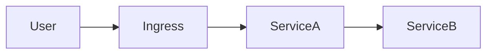
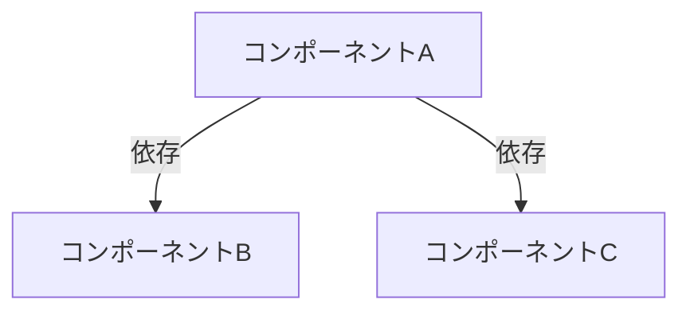

# アーキテクチャレビューテンプレート

このテンプレートを使って、Kubernetes 上の構成をレビューする。
各セクションを埋めていくことで、構成の問題点と改善案を体系的に整理できる。

---

## 1. サービス概要

| 項目 | 内容 |
|------|------|
| サービス名 | （例: mini-app） |
| 目的 | （例: カウンター機能を持つ Web アプリケーション） |
| 利用者 | （例: 社内ユーザ / 一般ユーザ） |
| 想定トラフィック | （例: 100 req/s） |
| SLA 目標 | （例: 99.9%） |
| データの重要度 | （例: 消失不可 / 再作成可能） |

---

## 2. 構成図

ここに Mermaid またはテキストで構成図を記載する。



---

## 3. リソース一覧

| リソース種別 | 名前 | Namespace | レプリカ数 | 備考 |
|-------------|------|-----------|-----------|------|
| Deployment | | | | |
| Service | | | | |
| Ingress | | | | |
| ConfigMap | | | | |
| Secret | | | | |
| PVC | | | | |
| HPA | | | | |
| NetworkPolicy | | | | |

```bash
# リソース一覧の取得コマンド
kubectl get all -n <namespace> -o wide
kubectl get configmap,secret,ingress,pvc,hpa,networkpolicy -n <namespace>
```

---

## 4. スケーリング戦略

### 水平スケール（HPA）

| コンポーネント | スケール可否 | トリガー条件 | 最小/最大レプリカ | 課題 |
|-------------|------------|------------|-----------------|------|
| | | | | |

### 垂直スケール（VPA）

| コンポーネント | 現在の requests | 現在の limits | 実使用量 | 適正値 |
|-------------|----------------|--------------|---------|--------|
| | | | | |

### スケール時の懸念

- [ ] ステートフルなコンポーネントの扱い
- [ ] DB コネクション数の上限
- [ ] セッション親和性の必要性
- [ ] 外部 API のレートリミット

---

## 5. 障害時の影響範囲

### 単一障害点（SPOF）

| コンポーネント | 障害時の影響 | 検知方法 | 復旧時間目標（RTO） |
|-------------|------------|---------|-------------------|
| | | | |

### 依存関係マップ



### 障害シナリオ

| シナリオ | 影響範囲 | 対策状況 |
|---------|---------|---------|
| Pod 障害 | | |
| ノード障害 | | |
| AZ 障害 | | |
| 依存サービス障害 | | |
| ネットワーク分断 | | |

---

## 6. セキュリティチェックリスト

### コンテナセキュリティ

- [ ] コンテナは非 root で実行されているか
- [ ] `readOnlyRootFilesystem` が設定されているか
- [ ] `allowPrivilegeEscalation: false` が設定されているか
- [ ] 不要な capability が drop されているか
- [ ] イメージの脆弱性スキャンが実施されているか
- [ ] イメージタグに latest を使っていないか（digest 固定が望ましい）

### ネットワークセキュリティ

- [ ] NetworkPolicy が設定されているか
- [ ] 不要なポートが公開されていないか
- [ ] TLS 終端が適切に行われているか
- [ ] 外部通信が必要最小限か

### Secret 管理

- [ ] Secret が暗号化されているか（base64 は暗号化ではない）
- [ ] Secret が Git リポジトリに含まれていないか
- [ ] Secret のローテーション手順があるか

### RBAC

- [ ] ServiceAccount が最小権限で設定されているか
- [ ] デフォルト ServiceAccount を使っていないか
- [ ] ClusterRole の使用が必要最小限か

---

## 7. 運用チェックリスト

### 監視・アラート

- [ ] メトリクス収集が設定されているか（Prometheus 等）
- [ ] ダッシュボードがあるか（Grafana 等）
- [ ] アラートルールが設定されているか
- [ ] アラートの通知先が設定されているか（Slack / PagerDuty 等）
- [ ] SLI / SLO が定義されているか

### ログ

- [ ] ログが構造化されているか（JSON 等）
- [ ] ログが集約されているか（Loki / Elasticsearch 等）
- [ ] ログのローテーション / 保持期間が設定されているか

### デプロイ

- [ ] CI/CD パイプラインがあるか
- [ ] ブルーグリーンまたはカナリアデプロイが可能か
- [ ] ロールバック手順が整備されているか
- [ ] デプロイ後の自動テストがあるか

### バックアップ・リカバリ

- [ ] データのバックアップが取得されているか
- [ ] リストア手順がテストされているか
- [ ] RPO（目標復旧時点）が定義されているか
- [ ] RTO（目標復旧時間）が定義されているか

### ドキュメント

- [ ] アーキテクチャ図が最新か
- [ ] Runbook（運用手順書）があるか
- [ ] オンコール体制が整備されているか
- [ ] ポストモーテムのテンプレートがあるか

---

## 8. 改善優先度

発見した問題をリスク x 対応コストで優先度付けする。

| # | 問題 | リスク（高/中/低） | 対応コスト（大/中/小） | 優先度 | 対応策 | 担当 | 期限 |
|---|------|-------------------|---------------------|--------|--------|------|------|
| 1 | | | | | | | |
| 2 | | | | | | | |
| 3 | | | | | | | |

### 優先度の決め方

```
優先度 = リスクの大きさ x 発生確率 / 対応コスト

高: すぐ対応（今スプリント）
中: 計画的に対応（今四半期）
低: バックログに積む
```

---

## レビュー記録

| 項目 | 内容 |
|------|------|
| レビュー実施日 | |
| レビュー参加者 | |
| 次回レビュー予定 | |
| 備考 | |
