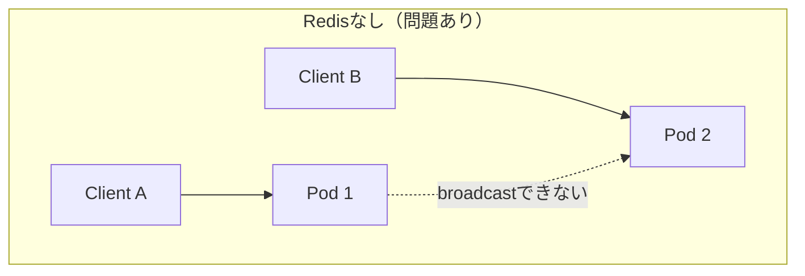
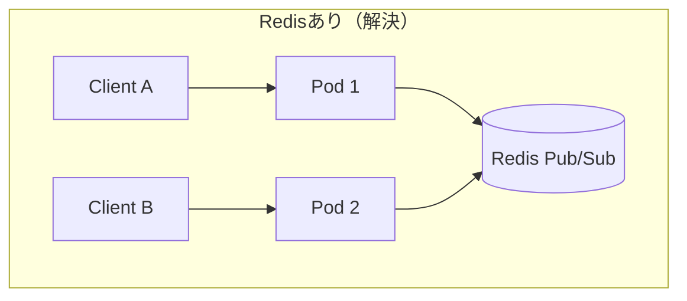

# Step 16: WebSocketスケール - 複数Podでのリアルタイム通信

## 目的

複数PodでWebSocketを扱う難しさを知る。Podを増やしただけではbroadcastが全クライアントに届かない問題を体験し、Redis Pub/Subによる解決策を理解する。

## 学ぶこと

- ステートフル接続のスケール問題
- Redis Pub/Subによるメッセージ中継
- Sticky session（セッションアフィニティ）の概念

## 核心の問題: Podを増やしただけではbroadcastが揃わない

各Podは自分に接続しているクライアントしか知らない。Pod 1に接続しているClient Aがメッセージを送っても、Pod 2に接続しているClient Bには届かない。

### Redisなし（問題あり）



Client AのメッセージはPod 1内のクライアントにしか届かない。Pod 2のClient Bには届かない。

### Redisあり（解決）



全PodがRedisのPub/Subチャネルを購読する。メッセージを受けたPodはRedisにpublishし、全Podがsubscribeで受け取って自分のクライアントにbroadcastする。

## ディレクトリ構成

```
step16-websocket-scale/
├── README.md                    # このファイル
├── deployment-no-redis.yaml     # Redisなし（3 Pod）- 問題を体験
└── deployment-with-redis.yaml   # Redisあり（3 Pod）- 解決版
```

## 前提条件

- Step 15が完了していること（Service, Ingressが存在）
- Step 11のRedisが動いていること（`deployment-with-redis.yaml`で使用）
- `realtime-api`イメージがビルド・ロード済みであること

## 実行手順

### Phase 1: Redisなしで問題を体験する

```bash
kubectl apply -f deployment-no-redis.yaml
```

Podが3つ起動するのを確認する:

```bash
kubectl get pods -n mini-app -l app=realtime-api
```

ブラウザで複数タブを開いて`http://ws.local`にアクセスする。各タブは異なるPodに振り分けられる可能性がある。

片方のタブでメッセージを送信する。同じPodに接続しているタブにはメッセージが届くが、別のPodに接続しているタブには届かない。

各Podのログを確認する:

```bash
kubectl logs -l app=realtime-api -n mini-app --prefix
```

Pod 1で受信したメッセージがPod 2、Pod 3のログには出ていないことがわかる。

### Phase 2: Redis Pub/Subで解決する

Step 11のRedisが動いていることを確認する:

```bash
kubectl get pods -n mini-app -l app=redis
```

Redis対応版をデプロイする:

```bash
kubectl apply -f deployment-with-redis.yaml
```

Podが再作成されるのを待つ:

```bash
kubectl rollout status deployment/realtime-api -n mini-app
```

同じ操作を繰り返す。複数タブでメッセージを送信すると、全タブでメッセージが同期される。

## 確認方法

```bash
# 全Pod(3つ)がRunningであること
kubectl get pods -n mini-app -l app=realtime-api

# 3つ以上のタブで接続し、全タブでメッセージが同期されること
# ブラウザで http://ws.local を3つ以上のタブで開く

# 各Podのログで、Redis経由のメッセージ中継を確認
kubectl logs -l app=realtime-api -n mini-app --prefix | tail -20
```

## Sticky Session（セッションアフィニティ）

Ingressに以下のアノテーションを追加すると、同じクライアントが常に同じPodに接続し続ける:

```yaml
annotations:
  nginx.ingress.kubernetes.io/affinity: "cookie"
  nginx.ingress.kubernetes.io/session-cookie-name: "INGRESSCOOKIE"
  nginx.ingress.kubernetes.io/session-cookie-expires: "172800"
  nginx.ingress.kubernetes.io/session-cookie-max-age: "172800"
```

Sticky sessionは接続の安定性を高めるが、以下の制限がある:

- Pod再起動時にはセッションが切れ、再接続が必要
- 負荷が偏る可能性がある（特定のPodに接続が集中）
- broadcastの問題は解決しない（Redis Pub/Subは依然必要）

## 接続状態をメモリに持つことの危険性

- **Pod再起動で全接続切断**: Deploymentの更新やPod障害で、そのPodの全WebSocket接続が切れる
- **新しいPodへの再接続が必要**: クライアント側で再接続ロジックが必須
- **切断から再接続間のメッセージロスト**: 再接続するまでの間に送られたメッセージは受け取れない

## よくある失敗

### replicaを増やせばリアルタイムもスケールすると思う

HTTPのステートレスなAPIとは違い、WebSocketはステートフル。Podを増やしても各Podは自分のクライアントしか知らない。Pod間のメッセージ中継の仕組みが別途必要。

### Redisなしで全体broadcastが可能と誤解する

1 Podでは問題なく動いていたbroadcastが、複数Podにした途端に壊れる。これはローカル開発では気づきにくい典型的な問題。

## 本番だとどう変わるか

- **NATS / Kafka**: Redis Pub/Subよりスケーラブルなメッセージブローカーを使う
- **専用Gateway**: WebSocket接続を管理する専用のゲートウェイレイヤーを設ける
- **専用Realtime基盤**: Ably、Pusher、Socket.ioクラスタなど、接続管理をマネージドサービスに委譲する
- **接続状態の永続化**: メモリだけでなく、外部ストレージに接続メタデータを保存する
- **graceful shutdown**: Pod終了時にクライアントに切断を通知し、再接続を促す

---

次のステップでは、Step 17でリアルタイム接続の負荷試験を行い、接続数増加に伴うボトルネックを体験する。CPU、メモリ、goroutine数などのメトリクスを計測し、スケーリングの判断基準を学ぶ。
